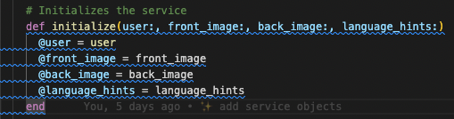
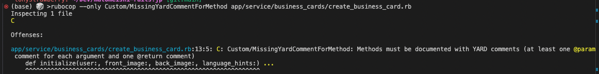
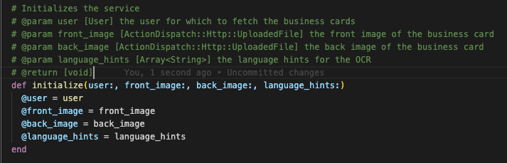
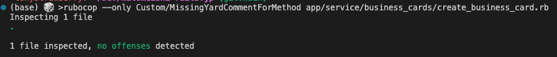

Hello! 👋

All Ruby developers must have heard of RuboCop, a static code analyzer and formatter based on the community Ruby style guide.
There are already many built-in cops in RuboCop that should cover most of the common style guide rules.

However, there are times when you want to enforce your own custom rules that are not covered by the built-in cops. In my case, I wanted to enforce that all methods in my Rails application have a YARD-style comment like so:

```ruby
  # Concatenates two strings.
  # @param str1 [String] the first argument
  # @param str2 [String] the second argument
  # @return [String] the result
  def concatenate(str1, str2)
    "#{str1} #{str2}"
  end
end
```

Reference: https://rubydoc.info/gems/yard/file/docs/GettingStarted.md

# Writing a custom RuboCop cop

I am going to write a custom RuboCop cop that enforces the presence of a YARD-style comment on methods in Ruby.
For a custom cop, the ideal place to put it is in the `lib/rubocop/cop/custom` directory of your Rails application.

Let's create a new cop called `Custom/MissingYardCommentForMethod`:

```ruby
module RuboCop
  module Cop
    module Custom
      # This cop checks that all methods have YARD documentation comments.
      # It checks for comments directly above the methods and performs presence checks for @param and @return tags.
      class MissingYardCommentForMethod < Base
        MSG = 'Methods must be documented with YARD comments (at least one `@param` comment for each argument and one @return comment)'.freeze

        def on_def(node)
          check_for_yard_comments(node)
        end

        def on_defs(node)
          check_for_yard_comments(node)
        end

        private

        # Perform the check for YARD comments on the given node
        # @param node [RuboCop::AST::Node] the node to check
        # @return [void]
        def check_for_yard_comments(node)
          preceding_comments = preceding_comment_lines(node)

          unless documented_with_yard?(node, preceding_comments)
            add_offense(node, message: MSG)
          end
        end

        # Extract the comments directly above the method definition
        # @param node [RuboCop::AST::Node] the node to check
        # @return [Array<String>] the comments directly above the method definition
        def preceding_comment_lines(node)
          buffer = node.location.expression.source_buffer
          line_number = node.location.line - 1
          comments = []

          while line_number >= 0
            line = buffer.source_line(line_number).strip
            break unless line.start_with?('#')

            comments.unshift(line)
            line_number -= 1
          end

          comments
        end

        # For each argument in the method definition, check if there is a
        # corresponding @param tag in the comments.
        # Also check if there is a @return tag.
        # @param node [RuboCop::AST::Node] the node to check
        # @param comments [Array<String>] the comments to check
        # @return [Boolean] whether the method is documented with YARD comments
        def documented_with_yard?(node, comments)
          method_name = node.method_name.to_s
          method_params = node.arguments.argument_list.map { |arg| arg.name.to_s }

          documented_params = comments.select { |comment| comment.strip.start_with?('# @param') }
                                      .map { |comment| comment.scan(/@param (\S+)/).flatten }
                                      .flatten

          documented_return = comments.any? { |comment| comment.strip.start_with?('# @return') }

          documented_params.sort == method_params.sort && documented_return
        end
      end
    end
  end
end
```

Let's break down the above cop file:
- `MSG` is the message that will be displayed when the cop is triggered. It will be passed to `add_offense` if the offense is detected.
- `on_def` and `on_defs` are the entry points for the cop. They are called when a method definition is encountered. More specifically, `on_def` is called for instance methods, and `on_defs` is called for class methods. Please refer to the `parser` gem documentation for more information on the AST nodes.
- `add_offense` is a method inherited from `RuboCop::Cop::Base` that is used to record an offense.
- Then we have our own custom methods:
  - `check_for_yard_comments`: This method is calling the below two methods and checking if the method is documented with YARD comments.
  - `preceding_comment_lines`: This method extracts the comments directly above the method definition.
  - `documented_with_yard?`: This method checks if the method is documented with YARD comments by comparing the method arguments with the documented parameters and checking for the presence of a `@return` tag.

The biggest challenge in writing a custom cop is understanding the AST nodes and how to traverse them. I thought the resources were a bit lacking so I had to rely on the `parser` gem documentation, the articles I found on the internet, and ChatGPT for some hints.
Unless I spend more time on this, I don't think I can fully understand the AST nodes and how to traverse them to be honest.

# Registering the custom RuboCop cop and using it

To register the custom cop, add the following line to your `.rubocop.yml` file:

```yaml
require:
  - ./lib/rubocop/cop/custom/missing_yard_comment_for_method.rb
```

Now, let's see the cop in action by running RuboCop on a sample Ruby file.

## When the method does not have a YARD comment 🚨

The defined method below does not have @param and @return tags in the comment lines above it.



So let's execute the RuboCop command (let's only run `Custom/MissingYardCommentForMethod` cop):

```bash
rubocop --only Custom/MissingYardCommentForMethod app/service/business_cards/create_business_card.rb
```

As expected, the cop triggers an offense because the method is not documented with YARD comments.



## When the method has a YARD comment ✅

For this second example, our method will have all the required YARD comments.



By running the RuboCop command again, we should not see any offenses:



# Testing the custom RuboCop cop

Testing a custom RuboCop cop is similar to testing any other Ruby class.
To test the custom cop, let's mimic our folder structure in the `spec` folder by creating a test file in the `spec/lib/rubocop/cop/custom/missing_yard_comment_for_method` directory (I am using RSpec for testing).

`rubocop` is providing use with a `Commissioner` class that can be used to investigate the offenses reported by the cop.

```ruby
config = RuboCop::Config.new({ described_class.badge.to_s => {} }, "/") # Create a new RuboCop config with only the custom cop
cop = RuboCop::Cop::Custom::MissingYardCommentForMethod.new(config)
source = <<~RUBY
  def initialize(user:, business_card_code:, attributes:)
    @business_card = user.business_cards.find_by!(code: business_card_code)
    @attributes = attributes
  end
RUBY

RuboCop::Cop::Commissioner.new([cop]).investigate(cop.parse(source)) # -> returns an investigation report with detected offenses
```

So if we used the above code in our RSpec test file, we can test the custom cop by passing different sources and checking if the offenses are detected correctly. Here is how I did it.

```ruby
# frozen_string_literal: true

require 'rails_helper'
require 'rubocop'
require 'rubocop/cop/custom/missing_yard_comment_for_method'

RSpec.describe RuboCop::Cop::Custom::MissingYardCommentForMethod do
  let(:config) { RuboCop::Config.new({ described_class.badge.to_s => {} }, "/") }
  let(:cop) { described_class.new(config) }
  let(:commissioner) { RuboCop::Cop::Commissioner.new([cop]) }

  context "when a method has YARD comment" do
    let(:source) do
      <<~RUBY
        # Initializes the service
        # @param user [User] the user for which to update the business card
        # @param business_card_code [String] the code of the business card to update
        # @param attributes [Hash] the attributes to update
        # @return [void]
        def initialize(user:, business_card_code:, attributes:)
          @business_card = user.business_cards.find_by!(code: business_card_code)
          @attributes = attributes
        end
      RUBY
    end

    it "does not record an offense" do
      investigation_report = commissioner.investigate(cop.parse(source))

      expect(investigation_report.offenses).to be_blank
    end
  end

  context "when a method does not have correct YARD comment" do
    shared_examples "records an offense" do
      it "records an offense" do
        investigation_report = commissioner.investigate(cop.parse(source))

        expect(investigation_report.offenses).not_to be_blank
        expect(investigation_report.offenses.first.message).to eq(described_class::MSG)
      end
    end

    context "when a method does not have YARD comment at all" do
      let(:source) do
        <<~RUBY
          def initialize(user:, business_card_code:, attributes:)
            @business_card = user.business_cards.find_by!(code: business_card_code)
            @attributes = attributes
          end
        RUBY
      end

      it_behaves_like "records an offense"
    end

    context "when a method does not have @param tag" do
      let(:source) do
        <<~RUBY
          # Initializes the service
          # @return [void]
          def initialize(user:, business_card_code:, attributes:)
            @business_card = user.business_cards.find_by!(code: business_card_code)
            @attributes = attributes
          end
        RUBY
      end

      it_behaves_like "records an offense"
    end

    context "when a method does not have @return tag" do
      let(:source) do
        <<~RUBY
          # Initializes the service
          # @param user [User] the user for which to update the business card
          # @param business_card_code [String] the code of the business card to update
          # @param attributes [Hash] the attributes to update
          def initialize(user:, business_card_code:, attributes:)
            @business_card = user.business_cards.find_by!(code: business_card_code)
            @attributes = attributes
          end
        RUBY
      end

      it_behaves_like "records an offense"
    end
  end
end
```

Now we can run the RSpec test file to ensure that the custom cop is working as expected.

```bash
bundle exec rspec spec/lib/rubocop/cop/custom/missing_yard_comment_for_method_spec.rb
```

# Conclusion

In this article, we learned how to write a custom RuboCop cop that enforces the presence of YARD comments on methods in Ruby.
I hope this article gave you a good starting point to write your own custom RuboCop cops and test them effectively.

# References

- [RuboCop documentation](https://docs.rubocop.org/rubocop/development.html)
- [Rubocop AST](https://docs.rubocop.org/rubocop-ast/index.html)
- [Create a custom RuboCop cop (FastRuby.io)](https://www.fastruby.io/blog/rubocop/code-quality/create-a-custom-rubocop-cop.html/)
- [Rubocop: Custom Cops for Custom Needs (thoughtbot.com)](https://thoughtbot.com/blog/rubocop-custom-cops-for-custom-needs)
