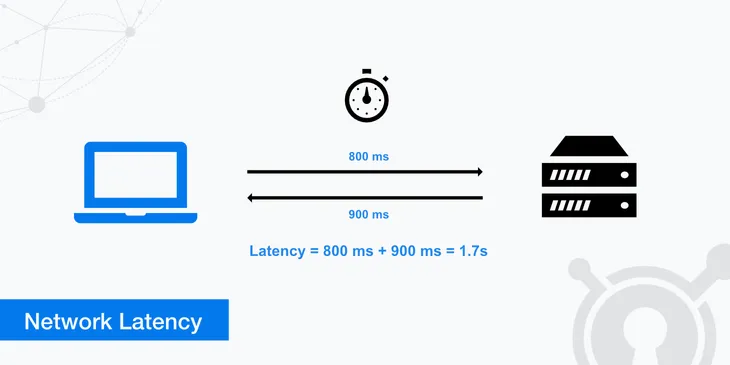

Hello! 👋

As a web developer, I am constantly working with APIs. Whether it's building a new API or consuming an existing one, performance is always a key concern. According to [Google](https://think.storage.googleapis.com/docs/mobile-page-speed-new-industry-benchmarks.pdf), 53% of mobile site visits are abandoned if pages take longer than 3 seconds to load. This shows how important it is to have fast APIs for a better user experience.

Speed of APIs are often measured in terms of **latency**. It is the time it takes for a request to reach the server and get the first byte of the response.


*Reference: https://www.keycdn.com/support/network-latency*

You can find more information about latency [here](https://www.keycdn.com/support/network-latency).

Now that we understand the importance of having fast APIs, let's look at some tips to improve the speed of your APIs.
I will try to list them in order of complexity of implementation.

## When the backend is slow... 🐢

### Indexing the database

Let's say you have the below query for fetching a user by their email address.

```sql
SELECT * FROM users WHERE email = 'tony@example.com';
```

If the `email` column is not indexed, the database will have to scan the entire `users` table to find the user with the given email address. As a result, the more users you have, the slower the query will be.
On the other hand, if the `email` column is indexed, the database creates another data structure that allows it to quickly find the user with the given email address like finding a record in a hash table.

Indexes are also beneficial for columns that are frequently used in `JOIN` (for `JOIN`, it's often foreign keys), and `ORDER BY` clauses.

**Solution**: Simply add an index on the columns you frequently query on.

### Only fetching the columns you need with SELECT

When you use `SELECT *` in your query, you are fetching all the columns of the table. This is not a problem if you need all the columns. But if you only need a few columns, fetching all the columns is unnecessary and can slow down the query.

Indeed, it would increase network traffic and memory usage.

Another in-depth explanation can be found here: https://stackoverflow.com/questions/3639861/why-is-select-considered-harmful

**Solution**: Only fetch the columns you need.

### Using pagination

If you have a large dataset, it is unlikely you will need to fetch and show all the records at once. Applying pagination to your API and DB queries will reduce the amount of data fetched and improve the speed of your API.

```sql
SELECT * FROM users LIMIT 10 OFFSET 0;
```

**Solution**: Implement pagination in your API using `LIMIT` and `OFFSET` in your SQL queries.

### Solve the N+1 queries
N+1 queries are a common problem when working with ORMs (in my case, ActiveRecord with Ruby on Rails). It happens when you fetch a list of records and then for each record, you fetch related records. This results in N+1 queries where N is the number of records fetched.

```ruby
users = User.all
users.each do |user|
  puts user.posts
end
```

In the above example, if you have 100 users, you will end up making 101 queries (1 query to fetch all users and 100 queries to fetch the posts for each user). With a large dataset, this can slow down your API significantly.

```sql
SELECT * FROM users;

SELECT * FROM posts WHERE user_id = 1;
SELECT * FROM posts WHERE user_id = 2;
SELECT * FROM posts WHERE user_id = 3;
...
```

Many ORMs provide a way to eager load the related records to avoid N+1 queries. In ActiveRecord, you can use `includes` to eager load the related records.

```ruby
users = User.includes(:posts)

users.each do |user|
  puts user.posts
end
```

This will fetch all the users and their posts in 2 queries.

```sql
SELECT * FROM users;

SELECT * FROM posts WHERE user_id IN (1, 2, 3, ...);
```

**Solution**: Use eager loading to avoid N+1 queries.

### Using caching

If your data does not change frequently, you can cache the response of your DB queries. This will reduce the number of queries to the database, making the load on the database lighter and improving the speed of retrieval.
Be careful, though, as caching can lead to stale data if not managed properly. A cache busting mechanism should be in place to invalidate the cache when the data changes if you want to avoid this.

**Solution**: Use in-memory caching mechanisms like Redis or Memcached to cache the response of your DB queries.

### Parallelizing code execution

I had a case where I had to fetch data from multiple APIs and combine the results to send back to the client. The API calls were independent of each other, so I could fetch them in parallel.
By fetching them in parallel, I was able to reduce the total time taken to fetch all the data from the APIs and thus improve the speed of my API.

**Solution**: Identify independent tasks in your execution context and execute them in parallel.

### Using connection pooling

Opening a new connection to the database is an expensive operation. If you open a new connection for every query, you will waste time in establishing a connection rather than executing the query.
Connection pooling allows you to reuse existing connections, thus reducing the time taken to establish a connection. For example, RDS Proxy in AWS provides connection pooling for RDS databases and can be used with Lambda functions.

**Solution**: Use connection pooling to reuse existing connections.

### Delegate your heavy lifting to a background job

If you have a task that is heavy and does not need to be done synchronously, you can delegate it to a background job.
This way, the user does not have to wait for the task to complete, and the API can respond faster. This is especially useful for tasks like sending emails, generating reports, importing data in bulk, etc.

Your database can keep track of the status of the background job, and the user can query the status of the job using a different API endpoint.

**Solution**: Use a background job processing system for heavy tasks.

### Using a CDN

If you have static assets like images, CSS, and JS files, you can use a CDN to cache these assets closer to the user. This will reduce the latency in fetching these assets and improve the speed of your API. Generally, static assets are stored in storage services like S3, and the CDN is configured to fetch these assets from S3 and cache them. But

CDN can also cache API responses, but you need to be careful with this as it can lead to stale data being served to the user. A cache busting mechanism should be implemented to invalidate the cache when the data changes or if having stale data is acceptable, you can set a short TTL for the cache to make it less likely to serve stale data.

**Solution**: Use a CDN to cache static assets and API responses.

# Conclusion

That concludes my list of tips to improve the speed of your APIs. I hope you found them useful and can apply them to your APIs to make them faster and provide a better user experience.
