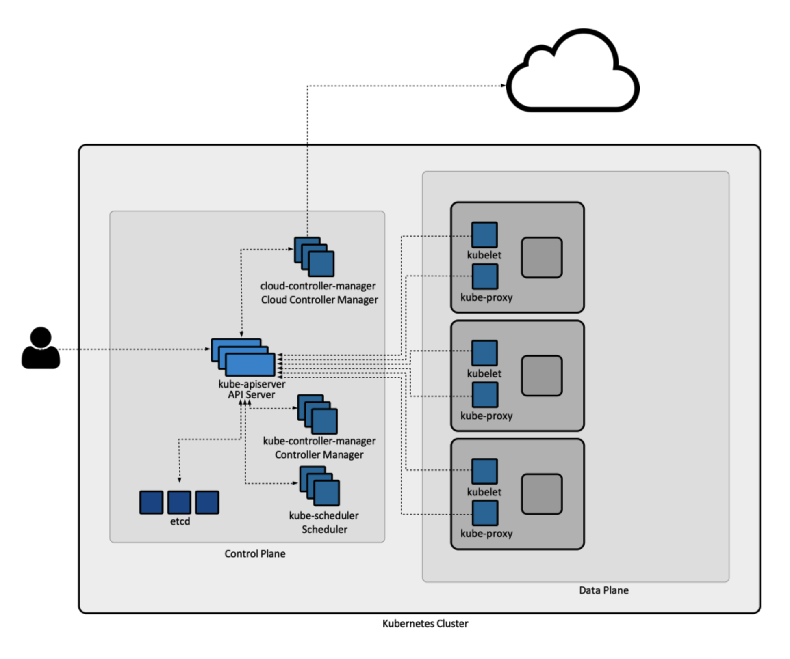
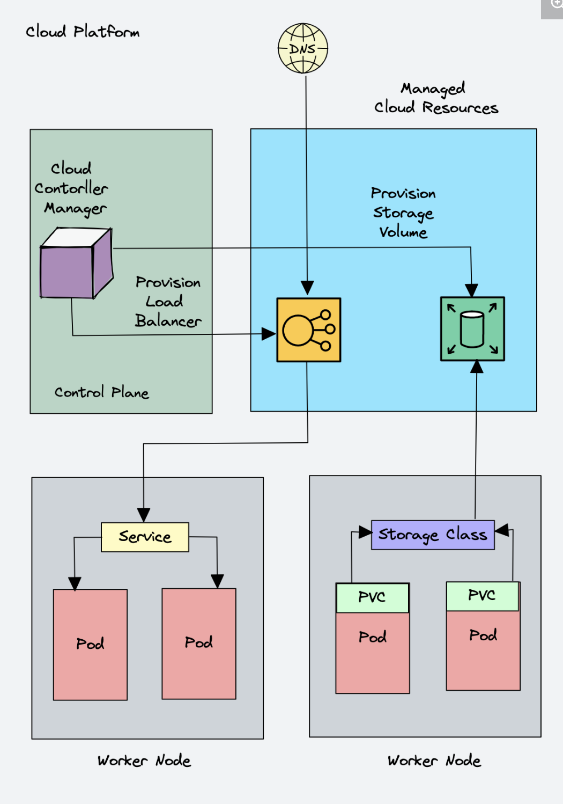
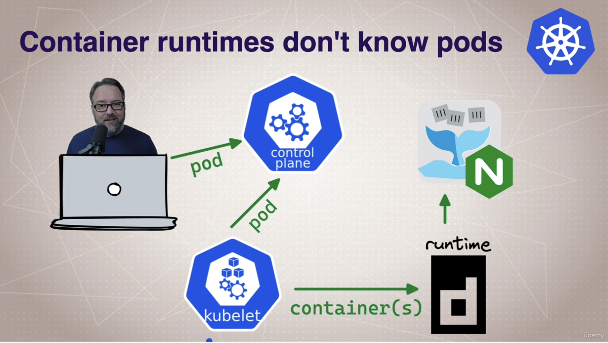
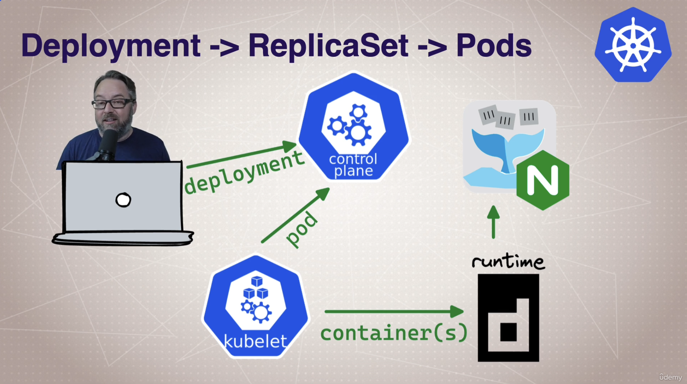

## Basic Terms: System Parts

- `kubernetes`: the whole orchestration system
  - k8s "k-eights" or Kube for short
- `kubectl`: CLI to configure Kubernetes and manage applications
  - using "cube control" official pronunciation
- `node`: single server in the k8s cluster
- `kubelet`: `kubernetes` agent running on each node
- `control plane`: set of containers that manage the cluster
  - includes API server, scheduler, controller manager, and etcd
  - sometimes called the "master"


Reference: https://kb.novaordis.com/index.php/Kubernetes_Control_Plane_and_Data_Plane_Concepts

## Kubernetes Container Abstractions

- `pod`: one or more containers running together on one node
  - smallest deployable unit in k8s
  - containers in a pod share the same network and storage
- `controller`: for creating and updating pods
  - many types of controllers like `ReplicaSet`, `Deployment`, `StatefulSet`, etc.
- `service`: network endpoint to connect to a pod (persistent endpoint in the cluster)
- `namespace`: filtered group of objects in the cluster
  - just a filter and not a security feature


Reference: https://devopscube.com/kubernetes-architecture-explained/

## My first pod with `kubectl run`

- Get the `kubectl` version
```bash
(base) 🐉 >kubectl version
Client Version: v1.28.3
Kustomize Version: v5.0.4-0.20230601165947-6ce0bf390ce3
Server Version: v1.27.7+k3s2
```

- Two ways of deploy a pod (containers): via `kubectl run` or `kubectl apply` (YAML).
  - Deploy a pod with `kubectl run`:
    ```bash
    (base) 🐉 >kubectl run my-nginx --image=nginx:alpine
    pod/my-nginx created

    (base) 🐉 >kubectl get pods
    NAME       READY   STATUS    RESTARTS   AGE
    my-nginx   1/1     Running   0          57s

    (base) 🐉 >kubectl get all
    NAME           READY   STATUS    RESTARTS   AGE
    pod/my-nginx   1/1     Running   0          104s

    NAME                 TYPE        CLUSTER-IP   EXTERNAL-IP   PORT(S)   AGE
    service/kubernetes   ClusterIP   10.43.0.1    <none>        443/TCP   164d
    ```

# Pods: why do they exist?

- Unlike Docker, you can't create a container directly in Kubernetes.
- You need to create a pod, which is a wrapper around the container.
  - Then Kubernetes will create the container for you inside the pod.
- `kubelet` (node agent) tells the container runtime to create the container.
- Every type of resource to run container uses **pods**.



## `kubectl` cheat sheet

- https://kubernetes.io/docs/reference/kubectl/cheatsheet/
- https://kubernetes.io/docs/reference/kubectl/docker-cli-to-kubectl/

## Creating a deployment with `kubectl`

```bash
(base) 🐉 >kubectl create deployment my-nginx --image nginx
deployment.apps/my-nginx created

(base) 🐉 >kubectl get pods
NAME                      READY   STATUS    RESTARTS   AGE
my-nginx                  1/1     Running   0          21m
my-nginx-b8dd4cd6-q4grw   1/1     Running   0          112s

(base) 🐉 >kubectl get all
NAME                          READY   STATUS    RESTARTS   AGE
pod/my-nginx                  1/1     Running   0          25m
pod/my-nginx-b8dd4cd6-q4grw   1/1     Running   0          5m35s

NAME                 TYPE        CLUSTER-IP   EXTERNAL-IP   PORT(S)   AGE
service/kubernetes   ClusterIP   10.43.0.1    <none>        443/TCP   164d

NAME                       READY   UP-TO-DATE   AVAILABLE   AGE
deployment.apps/my-nginx   1/1     1            1           5m35s

NAME                                DESIRED   CURRENT   READY   AGE
replicaset.apps/my-nginx-b8dd4cd6   1         1         1       5m35s
```

- When creating a deployment, Kubernetes creates a `replicaset`.
- A `replicaset` corresponds to one version of the deployment. So many `replicasets` can exist for one deployment.



## Scaling `ReplicaSets`

```bash
(base) 🐉 >kubectl create deployment my-apache --image httpd
deployment.apps/my-apache created

(base) 🐉 >kubectl get all
NAME                             READY   STATUS              RESTARTS   AGE
pod/my-apache-55878d86f4-msljw   0/1     ContainerCreating   0          11s

NAME                 TYPE        CLUSTER-IP   EXTERNAL-IP   PORT(S)   AGE
service/kubernetes   ClusterIP   10.43.0.1    <none>        443/TCP   164d

NAME                        READY   UP-TO-DATE   AVAILABLE   AGE
deployment.apps/my-apache   0/1     1            0           11s

NAME                                   DESIRED   CURRENT   READY   AGE
replicaset.apps/my-apache-55878d86f4   1         1         0       11s
```

Now, on to scaling the deployment:
```bash
(base) 🐉 >kubectl scale deployment/my-apache --replicas 2
deployment.apps/my-apache scaled

(base) 🐉 >kubectl get all
NAME                             READY   STATUS              RESTARTS   AGE
pod/my-apache-55878d86f4-msljw   1/1     Running             0          108s
pod/my-apache-55878d86f4-s78ls   0/1     ContainerCreating   0          11s

NAME                 TYPE        CLUSTER-IP   EXTERNAL-IP   PORT(S)   AGE
service/kubernetes   ClusterIP   10.43.0.1    <none>        443/TCP   164d

NAME                        READY   UP-TO-DATE   AVAILABLE   AGE
deployment.apps/my-apache   1/2     2            1           108s

NAME                                   DESIRED   CURRENT   READY   AGE
replicaset.apps/my-apache-55878d86f4   2         2         1       108s
```

## Inspecting resources

```bash
(base) 🐉 >kubectl get all
NAME                             READY   STATUS              RESTARTS   AGE
pod/my-apache-55878d86f4-msljw   1/1     Running             0          108s
pod/my-apache-55878d86f4-s78ls   0/1     ContainerCreating   0          11s

NAME                 TYPE        CLUSTER-IP   EXTERNAL-IP   PORT(S)   AGE
service/kubernetes   ClusterIP   10.43.0.1    <none>        443/TCP   164d

NAME                        READY   UP-TO-DATE   AVAILABLE   AGE
deployment.apps/my-apache   1/2     2            1           108s

NAME                                   DESIRED   CURRENT   READY   AGE
replicaset.apps/my-apache-55878d86f4   2         2         1       108s

(base) 🐉 >kubectl get deployment my-apache
NAME        READY   UP-TO-DATE   AVAILABLE   AGE
my-apache   2/2     2            2           9m32s

(base) 🐉 >kubectl get all -o wide
NAME                             READY   STATUS    RESTARTS   AGE     IP           NODE                   NOMINATED NODE   READINESS GATES
pod/my-apache-55878d86f4-msljw   1/1     Running   0          9m45s   10.42.0.44   lima-rancher-desktop   <none>           <none>
pod/my-apache-55878d86f4-s78ls   1/1     Running   0          8m8s    10.42.0.45   lima-rancher-desktop   <none>           <none>

NAME                 TYPE        CLUSTER-IP   EXTERNAL-IP   PORT(S)   AGE    SELECTOR
service/kubernetes   ClusterIP   10.43.0.1    <none>        443/TCP   164d   <none>

NAME                        READY   UP-TO-DATE   AVAILABLE   AGE     CONTAINERS   IMAGES   SELECTOR
deployment.apps/my-apache   2/2     2            2           9m45s   httpd        httpd    app=my-apache

NAME                                   DESIRED   CURRENT   READY   AGE     CONTAINERS   IMAGES   SELECTOR
replicaset.apps/my-apache-55878d86f4   2         2         2       9m45s   httpd        httpd    app=my-apache,pod-template-hash=55878d86f4

(base) 🐉 >kubectl get all -o yaml
apiVersion: v1
items:
- apiVersion: v1
  kind: Pod
  metadata:
    creationTimestamp: "2024-04-15T05:52:29Z"
    generateName: my-apache-55878d86f4-
    labels:
      app: my-apache
      pod-template-hash: 55878d86f4
    name: my-apache-55878d86f4-msljw
    namespace: default
    ownerReferences:
    - apiVersion: apps/v1
      blockOwnerDeletion: true
      controller: true
      kind: ReplicaSet
      name: my-apache-55878d86f4
      uid: cf9291c1-9410-4164-97a5-fb31ffedc7c3
    resourceVersion: "488031"
    uid: 21f788c6-ffd0-4420-92fd-ff87878fbb24
  spec:
    containers:
    - image: httpd
      imagePullPolicy: Always
      name: httpd
      resources: {}
      terminationMessagePath: /dev/termination-log
      terminationMessagePolicy: File
      volumeMounts:
      - mountPath: /var/run/secrets/kubernetes.io/serviceaccount
        name: kube-api-access-sxd9j
        readOnly: true
    dnsPolicy: ClusterFirst
    enableServiceLinks: true
    nodeName: lima-rancher-desktop

    ...
```

## Inspecting resources with `kubectl describe`

```bash
(base) 🐉 >kubectl describe deploy my-apache
Name:                   my-apache
Namespace:              default
CreationTimestamp:      Mon, 15 Apr 2024 14:52:29 +0900
Labels:                 app=my-apache
Annotations:            deployment.kubernetes.io/revision: 1
Selector:               app=my-apache
Replicas:               2 desired | 2 updated | 2 total | 2 available | 0 unavailable
StrategyType:           RollingUpdate
MinReadySeconds:        0
RollingUpdateStrategy:  25% max unavailable, 25% max surge
Pod Template:
  Labels:  app=my-apache
  Containers:
   httpd:
    Image:        httpd
    Port:         <none>
    Host Port:    <none>
    Environment:  <none>
    Mounts:       <none>
  Volumes:        <none>
Conditions:
  Type           Status  Reason
  ----           ------  ------
  Progressing    True    NewReplicaSetAvailable
  Available      True    MinimumReplicasAvailable
OldReplicaSets:  <none>
NewReplicaSet:   my-apache-55878d86f4 (2/2 replicas created)
Events:          <none>
```

```bash
(base) 🐉 >kubectl describe pod/my-apache-55878d86f4-msljw
Name:             my-apache-55878d86f4-msljw
Namespace:        default
Priority:         0
Service Account:  default
Node:             lima-rancher-desktop/192.168.5.15
Start Time:       Mon, 15 Apr 2024 14:52:29 +0900
Labels:           app=my-apache
                  pod-template-hash=55878d86f4
Annotations:      <none>
Status:           Running
IP:               10.42.0.44
IPs:
  IP:           10.42.0.44
Controlled By:  ReplicaSet/my-apache-55878d86f4
Containers:
  httpd:
    Container ID:   docker://39ac8f3d1493f231e57bb4bdd4ca7b38183da71ce67c342e6ba355efc7fb85f0
    Image:          httpd
    Image ID:       docker-pullable://httpd@sha256:73b2e9e2861bcfe682b9a67d83433b6a6b36176459134aa25ec711058075fd47
    Port:           <none>
    Host Port:      <none>
    State:          Running
      Started:      Mon, 15 Apr 2024 14:52:56 +0900
    Ready:          True
    Restart Count:  0
    Environment:    <none>
    Mounts:
      /var/run/secrets/kubernetes.io/serviceaccount from kube-api-access-sxd9j (ro)
Conditions:
  Type              Status
  Initialized       True
  Ready             True
  ContainersReady   True
  PodScheduled      True
Volumes:
  kube-api-access-sxd9j:
    Type:                    Projected (a volume that contains injected data from multiple sources)
    TokenExpirationSeconds:  3607
    ConfigMapName:           kube-root-ca.crt
    ConfigMapOptional:       <nil>
    DownwardAPI:             true
QoS Class:                   BestEffort
Node-Selectors:              <none>
Tolerations:                 node.kubernetes.io/not-ready:NoExecute op=Exists for 300s
                             node.kubernetes.io/unreachable:NoExecute op=Exists for 300s
Events:                      <none>
```

## Inspecting nodes

- List all our clusters nodes:
```bash
(base) 🐉 >kubectl get nodes
```

- List just our node with more details:
```bash
(base) 🐉 >kubectl get node/{node-name} -o wide
```

- Describe the node:
```bash
(base) 🐉 >kubectl describe node/{node-name}
```


## Watching resources

- Watch a command:
```bash
(base) 🐉 >kubectl get pods -w
NAME                         READY   STATUS    RESTARTS   AGE
my-apache-55878d86f4-msljw   1/1     Running   0          164m
my-apache-55878d86f4-s78ls   1/1     Running   0          163m
my-apache-55878d86f4-s78ls   1/1     Terminating   0          164m
my-apache-55878d86f4-rbsq7   0/1     Pending       0          0s
my-apache-55878d86f4-rbsq7   0/1     Pending       0          0s
my-apache-55878d86f4-rbsq7   0/1     ContainerCreating   0          0s
my-apache-55878d86f4-s78ls   0/1     Terminating         0          164m
my-apache-55878d86f4-s78ls   0/1     Terminating         0          164m
my-apache-55878d86f4-s78ls   0/1     Terminating         0          164m
my-apache-55878d86f4-s78ls   0/1     Terminating         0          164m
my-apache-55878d86f4-rbsq7   1/1     Running             0          11s
```

- Watch for only future events:
```bash
(base) 🌵 >kubectl get events --watch-only
LAST SEEN   TYPE     REASON             OBJECT                            MESSAGE
0s          Normal   Killing            pod/my-apache-55878d86f4-rbsq7    Stopping container httpd
0s          Normal   SuccessfulCreate   replicaset/my-apache-55878d86f4   Created pod: my-apache-55878d86f4-2wvqf
0s          Normal   Scheduled          pod/my-apache-55878d86f4-2wvqf    Successfully assigned default/my-apache-55878d86f4-2wvqf to lima-rancher-desktop
0s          Normal   Pulling            pod/my-apache-55878d86f4-2wvqf    Pulling image "httpd"
0s          Normal   Pulled             pod/my-apache-55878d86f4-2wvqf    Successfully pulled image "httpd" in 10.356865922s (10.356935922s including waiting)
0s          Normal   Created            pod/my-apache-55878d86f4-2wvqf    Created container httpd
0s          Normal   Started            pod/my-apache-55878d86f4-2wvqf    Started container httpd
```

## Container logs

- Get a container's logs (picks a random replica and the first container only)
```bash
(base) 🐉 >kubectl logs deploy/my-apache
```

- Follow new log entries, and start with the latest log line
```bash
(base) 🐉 >kubectl logs deploy/my-apache --follow --tail 1
```

- Get a specific container's logs in a pod
```bash
(base) 🐉 >kubectl logs pod/my-apache-55878d86f4-msljw -c httpd
```

- Get logs of all containers in a pod
```bash
(base) 🐉 >kubectl logs pod/my-apache-55878d86f4-msljw --all-containers=true
```

- Get multiple pods logs
```bash
(base) 🐉 >kubectl logs -l app=my-apache
```
