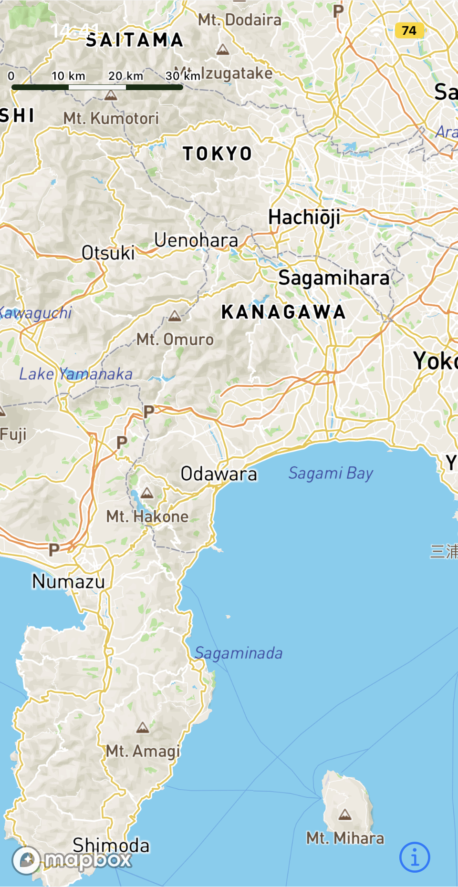
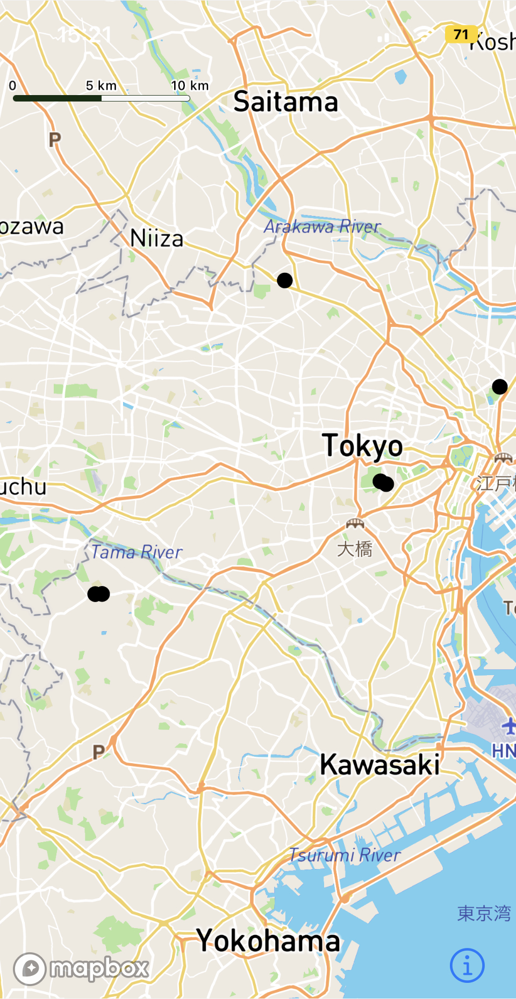
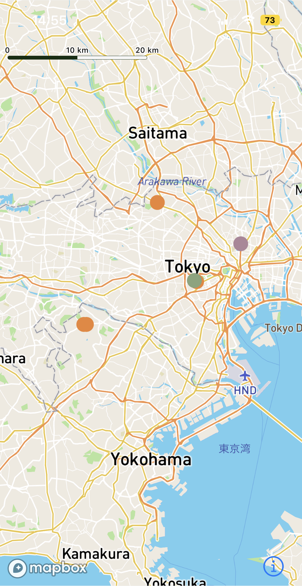
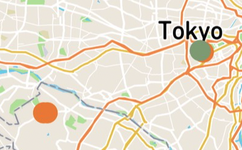

My interest for cross-platform mobile development has grown up these days so I decided to dive in and build and release a mobile application next year. In this mobile application, I am displaying a map using the Mapbox library. And I came across an interesting challenge: depending on the zoom level and the distance of the points (markers), grouping points together and displaying clusters to make the map more readable and less cluttered.

## Prerequisite and technical specifications

- I am using Expo to set up my React Native project.
- In order to use Mapbox, I created an account on the Mapbox website and retrieved an API key (https://account.mapbox.com/).
- I used this Mapbox Maps SDK: https://github.com/rnmapbox/maps and followed the installation instruction (https://github.com/rnmapbox/maps#installation)

## Displaying the map

First, let's display the default Mapbox map. It is as simple as rendering the `<MapboxGL.MapView />` component provided out of the box by the Mapbox SDK.

```jsx
const MapScreen = () => {
  return (
    <View className="relative flex-1">
      <MapboxGL.MapView style={{ flex: 1 }}></MapboxGL.MapView>
    </View >
  )
}
```



## Displaying the points of interest

Then, because I want to show some points of interests in the map, I will display some custom markers (colored circles) on the map.
I will use the `<MapboxGL.ShapeSource />` component that will allow us to show vector shapes on the map. It has a `shape` property that is either a URL to the GeoJSON file or the GeoJSON object itself.
GeoJSON is a standard format for geospatial data (see https://www.rfc-editor.org/rfc/rfc7946#section-3.3, https://geojson.org/)

To render the circles, I will use the `<MapboxGL.CircleLayer />` component.

```js
<MapboxGL.ShapeSource
  id="places"
  shape={shape}
>
  <MapboxGL.CircleLayer
    id="unclusteredCircle"
    sourceID="places"
  />
</MapboxGL.ShapeSource>
```

For displaying markers, I will take my `places` object containing my raw data coming from my API and format it into GeoJSON format that `<MapboxGL.ShapeSource />` will be able to read.
I will use the `FeatureCollection` object in order to provide a collection of `Feature` that will represent my `places`.

To explain it in a very simple way, `FeatureCollection` has a `features` field that is an array of `Feature`.
`Feature`, which represent a single `place` in my case, has a `properties` field that is any JSON object containing properties of my place (like the color, title and any other relevant information).
It also has a `geometry` field that is a `GeometryObject`. A `GeometryObject` can be a `Point`, a `Multipoint`... (the exhaustive list can be found here: https://www.rfc-editor.org/rfc/rfc7946#section-3.1)

We will use a `Point` in our case for representing a single position.


```js
 {
    "type": "FeatureCollection",
    "features": places.map((place) => (
      {
        "type": "Feature",
        "properties": place,
        "geometry": { "type": "Point", "coordinates": [ place.geopoint.lng, place.geopoint.lat, 0.0 ] } // coordinates takes the following array: [longitude, latitude, altitude]
      }))
  }
```

```jsx
const MapScreen = () => {
  const [ places, setPlaces ] = useState([]); // Places retrieved via API

  /* Fetch places via API */
  /* Example format:
    [
      {
        categories: [
          {
            color: "red"
          }
        ],
        geopoint: {
          lng: 139.123456,
          lat: 39.123456
        }
      },
      {
        categories: [
          {
            color: "red"
          }
        ],
        geopoint: {
          lng: 139.123456,
          lat: 39.123456
        }
      }
    ]
  */
  useEffect(() => {
    fetchPlaces((data) => {
      setPlaces(data);
    })
  }, []);


  /* Memoize shape (data source) because it should only change when places changes */
  const shape = useMemo(() => (
    {
      "type": "FeatureCollection",
      "features": places.map((place) => (
        {
          "type": "Feature",
          "properties": { ...place, ...{ color: place.categories[ 0 ].color } },
          "geometry": { "type": "Point", "coordinates": [ place.geopoint.lng, place.geopoint.lat, 0.0 ] }
        }))
    }
  ), [ places ]);

  return (
    <View className="relative flex-1">
      <MapboxGL.MapView style={{ flex: 1 }}>
        <MapboxGL.ShapeSource
          id="places"
          shape={shape}
        >
          <MapboxGL.CircleLayer
            id="unclusteredCircle"
            sourceID="places"
          />
        </MapboxGL.ShapeSource>
      </MapboxGL.MapView>
    </View >
  )
}
```



## Color the points of interest

Let's add some color to our places. To achieve this, let's use the color property defined inside the `categories` property of a single place object.
I will add a `style` property to the `<MapboxGL.CircleLayer />` and define the `circleColor` property.

The `circleColor` can directly take the color value (hexadecimal value) or a value defined in the `properties` field of our `Feature` object.
The way of retrieving the `color` from the following object is like so `[ "get", "color", [ "at", 0, [ "get", "categories", [ "properties" ] ] ] ]`.

```json
  {
    "type": "Feature",
    "properties": {
      "categories": [
        {
          "color": "red"
        }
      ],
      "geopoint": {
        "lng": 139.123456,
        "lat": 39.123456
      }
    },
    "geometry": { "type": "Point", "coordinates": [ 139.12345, 39.12345, 0.0 ] } // coordinates takes the following array: [longitude, latitude, altitude]
  }
```

Reference about expressions can be found here: https://docs.mapbox.com/mapbox-gl-js/style-spec/expressions/

```js
const MapScreen = () => {
  ...

  return (
    <View className="relative flex-1">
      <MapboxGL.MapView style={{ flex: 1 }}>
        <MapboxGL.ShapeSource
          id="places"
          shape={shape}
        >
          <MapboxGL.CircleLayer
            id="unclusteredCircle"
            sourceID="places"
            style={styles.unclusteredPointCircleLayer}
          />
        </MapboxGL.ShapeSource>
      </MapboxGL.MapView>
    </View >
  )
}

// Styles for Mapbox layers
// General Reference: https://github.com/rnmapbox/maps
// Reference for the expressions inside textField, circleColor, iconImage: https://docs.mapbox.com/mapbox-gl-js/style-spec/expressions/
const styles = {
  unclusteredPointCircleLayer: {
    circleColor: [ "get", "color", [ "at", 0, [ "get", "categories", [ "properties" ] ] ] ],
    circleRadius: 8
  }
};

export default MapScreen;
```



## Clusterize the points

Now, it is time to clusterize the points that are too close from each other. We can see in the below pictures that the points are too close from other making this area of the map too cluttered.
It would be nice to instead display a bigger circle with the number of points that are grouped together.



`<Mapbox.GL.ShapeSource />` is providing us three properties that will allow us to display clusters:
- `cluster`: Enables clustering on the source for point shapes.
- `clusterMaxZoomLevel`: Specifies the maximum zoom level at which to cluster points if clustering is enabled.
- `clusterRadius`: Specifies the radius of each cluster if clustering is enabled. A value of 512 produces a radius equal to the width of a tile. The default value is 50.

We will need to add a filter in order to determine when to show clusters or individual point. For this, the `point_count` property can be used to determine how many points there is in a cluster (see https://docs.mapbox.com/mapbox-gl-js/style-spec/sources/#geojson-cluster).
So it becomes very simple:
- when there is no `point_count`, we will hide the clusters and show the individual point.
- when there is any `point_count`, we will show the clusters and hide the individual point.

```js
  <MapboxGL.ShapeSource
    ref={shapeSource}
    id="places"
    shape={shape}
    cluster={true}
    clusterMaxZoomLevel={14}
    clusterRadius={50}
    onPress={onShapePress}
  >
    {/* Show the cluster circles */}
    <MapboxGL.CircleLayer
      id="clusters"
      sourceID="places"
      filter={[ "has", "point_count" ]}
      style={styles.clustersCircleLayer}
    />

    {/* Show the text (number of points inside each cluster) */}
    <MapboxGL.SymbolLayer
      id="clusterCount"
      sourceID="places"
      filter={[ "has", "point_count" ]}
      style={styles.clusterCountSymbolLayer}
    />

    {/* Show the individual point */}
    <MapboxGL.CircleLayer
      id="unclusteredCircle"
      sourceID="places"
      filter={[ "!", [ "has", "point_count" ] ]}
      style={styles.unclusteredPointCircleLayer}
    />
  </ MapboxGL.ShapeSource>
```

Let's also add some style (colors and text) to our clusters

```js
const styles = {
  clustersCircleLayer: {
    circleStrokeColor: "#d18e92",
    circleStrokeWidth: 3,
    circleStrokeOpacity: 1,
    circleColor: "red",
    circleRadius: 20,
  },
  clusterCountSymbolLayer: {
    textField: [ "get", "point_count_abbreviated" ], // Show the number of points that has been clustered
    textFont: [ "DIN Offc Pro Medium", "Arial Unicode MS Bold" ],
    textSize: 16,
    textColor: "white"
  },
  unclusteredPointCircleLayer: {
    circleColor: [ "get", "color", [ "at", 0, [ "get", "categories", [ "properties" ] ] ] ],
    circleRadius: 8
  }
}
```

<iframe width="427" height="759" src="https://www.youtube.com/embed/BBhx9tGnyO8" title="Clusters using Mapbox" frameborder="0" allow="accelerometer; autoplay; clipboard-write; encrypted-media; gyroscope; picture-in-picture; web-share" allowfullscreen></iframe>

## Conclusion

Voila! We made it. We managed to cluster close points in order to get a more readable at all zoom levels using Mapbox and its built-in functions.
In a future blog post, I will explain how we can zoom in to the appropriate zoom that will allow us to see points individually when touching the cluster on the screen.
