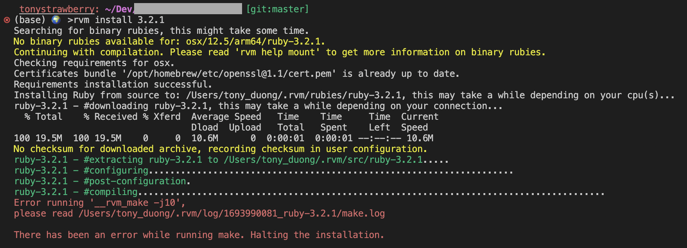

This article is just a quick note to myself. I'm writing it because I know I will forget about it and I will probably have to go through the same struggle again in the future.

So I was required to install a certain version of Ruby for a project I was working on. I usually use RVM to manage my Ruby versions. I simply tried to install the required version of Ruby by running `rvm install 3.2.2`.
And I got the following error:



After carefully looking at the logs, I found out that the error was caused by OpenSSL.
I previously installed the latest version of OpenSSL (version 3) using Homebrew. But it seems like that version is not supported yet: https://github.com/ruby/openssl/issues/369

So the solution (that I struggle to find a bit 😅) was to install an older version of OpenSSL. I used the following command to install OpenSSL version 1.1:

```bash
brew install openssl@1.1
```

Then I ran the following command to install Ruby:

```bash
rvm install 3.2.1 --with-openssl-dir=$(brew --prefix openssl@1.1)
```

Voila! It finally worked! 🎉
