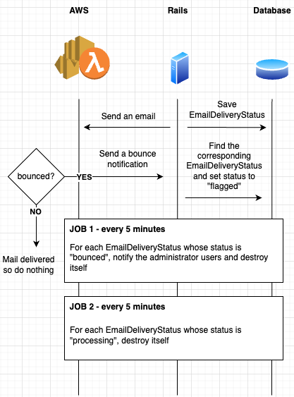

If you are thinking of implementing a mailing system for your application, you would surely need to find a way to know if the sent emails are successfully delivered or not. With AWS SES (Simple Email Service), it is possible to set up bounce webhook notifications whenever an email failed to be delivered.

In one of my recent backend projects at Monstarlab, I needed to find a way to notify administrator users whenever an email sent from the Rails application (through AWS SES) fails to reach the recipients. In this article, I will explain the approach I took for implementing such a system.

## Prerequisite: AWS SES setup to send email from a particular domain

The first thing you need to do is to create a domain identity for your domain through the AWS console by navigating to Amazon SES > Configuration > Verified identities.
You will then need to verify it to confirm that the domain you are using is effectively yours.

※ I will not go into the details for this setup. If you need some explanations about how to setup a particular domain for sending email, this guide from the AWS documentation will certainly help you: [https://docs.aws.amazon.com/ses/latest/dg/creating-identities.html#verify-domain-procedure](https://docs.aws.amazon.com/ses/latest/dg/creating-identities.html#verify-domain-procedure)

## Overview

The objective is to find a way to notify administrator users whenever an email sent from the Rails application (through AWS SES) fails to reach the recipients.

For this, we came up with the below design in order to implement our solution.

- Rails will be configured to use AWS SES to send emails.
- AWS SES will trigger a SNS topic subscription whenever a bounce is detected.
- SNS will then trigger an AWS Lambda function that will send a POST request to the Rails application.
- Rails application will then perform the appropriate action (in our case, notify the administrator users)


## Setting up AWS SES with SNS (Simple Notification Service) to send bounced notification

Now, let’s dive into the mail topic: the bounce email handling.

By default, no notification of any sort is sent when AWS SES fails to deliver an email. We need to set it up manually through the AWS console by navigating to Amazon SES > Configuration > Verified identities > (your domain) > Notifications.


You can see that we can setup SNS topic for three types of event:

- Bounce (when the email cannot be delivered for some reason)
- Complaint (when your sender email is marked as undesirable by the email recipient)
- Delivery (when the email is successfully delivered)

We need to create a SNS topic and assign it to the bounce notification.

<div class="html5-video-container">
  <video width="100%" controls="">
    <source src="https://engineering.monstar-lab.com/assets/img/articles/2022-10-05-Handling-bounced-emails-by-SES-with-Rails/sns-topic-creation.mp4" type="video/mp4">
  Your browser does not support HTML5 video.
  </video>
</div>

### Creating a SNS Topic

Following this, we will have to create a subscription to the created topic to be able to perform an action. In our case, we decided to send a webhook request to the Rails backend application so that the related administrator users for the bounced email can be notified.

### Creating a Lambda function for that topic

The subscription will be an AWS Lambda function that will be called whenever there is a bounce notification. This function will send a request to the provided ENDPOINT_URL (which is an endpoint of our backend application) along with the SNS body data that is containing useful data for our backend to identify the bounced email (like the message ID and also the message body).

```python
import json
import requests
import os

def lambda_handler(event, context):
    url = "https://monstar-lab.com/aws/receive_bounce_notice"

    # Body of the request
    # In case the sns_message_payload["Type"] == 'SubscriptionConfirmation', the body will contain a url ('SubscribeURL'). The backend application will need to send a get request to that url to confirm it is ready to receive the notifications from now
    # Non exhaustive body example: { "SubscribeURL" => "https://aws.ses.com" }
    #
		# In case the sns_message_payload["Type"] == 'Notification', the body will contain data about the bounced email such as message ID, the sender and recipient(s) etc.
    # Non exhaustive body example:
		#   {
		#      ...
    #      "Message": "{\"mail\":{\"timestamp\":\"2022-08-24T13:01:50.867Z\",\"source\":\"no_reply@dev-sc-bcc.com\",\"sourceArn\":\"arn:aws:ses:ap-northeast-1:013046240018:identity/dev-sc-bcc.com\",\"sourceIp\":\"10.0.78.173\",\"callerIdentity\":\"ses-smtp-user.20220530-164025\",\"sendingAccountId\":\"013046240018\",\"messageId\":\"01060182cff1dd93-75aeab42-e753-4ef6-b977-347b64eccb89-000000\",\"destination\":[\"non-existing-email4@monstar-lab.com\"]}}",
   #
    sns_message_payload = event["Records"][0]["Sns"]

    sns_message_headers = {
        "x-amz-sns-message-type": sns_message_payload["Type"], # Can be either SubscriptionConfirmation (for checking the endpoint is ready to get notifications) or Notification (for a simple notification)
    }

    try:
        r = requests.post(url = url, data = json.dumps(sns_message_payload), headers = sns_message_headers)
        print(r)
        return {
            'statusCode': 200,
            'body': json.dumps(str(r))
        }
    except Exception as e:
        print(e)
        return {
            'statusCode': 500,
            'body': json.dumps(str(e))
        }
```

Once the lambda function, it is necessary to set the previously created SNS topic as the function trigger.

And voilà, we are done on the AWS side!
We have successfully setup a system that will send a webhook request with relevant data to the backend application whenever there is a email that has failed to deliver! 🥳

## Handling the notifications on the Rails side

In the last part, we could have just sent an email to a particular email address instead of sending a webhook request to the application whenever there is a bounce notification. But in our case, depending on the email that was bounced, the recipients to be notified of this incident are different and only our backend application can identify them.

※ I will not explain the details of setting up the mailer inside Rails in this article.

In order, we will:

- Create a table for storing the emails that are being sent
- Configure the mailer so that every time an email is sent, the data is saved into the database
- Create a controller that will be responsible of receiving webhook requests in case of bouncing
- Creating a cron job that will run periodically to check any bounced email and notify the corresponding administrator users
- Creating another cron job that will periodically delete all non-bounced emails sent at least one day before



### Creating a table that will hold the email

Below is the structure of the table that is going to store all the email data.

```ruby
class CreateEmailDeliveryStatuses < ActiveRecord::Migration[7.0]
  def change
    create_table :email_delivery_statuses do |t|
      t.string :message_id, null: false # Message ID generated by SES
      t.references :user, null: false, polymorphic: true # User linked to that email
      t.string :recipient_email, null: false # Recipient email address
      t.string :email_type, null: false # Method name that trigger the email sending
      t.datetime :sent_at, null: false # Date and time of email sending
      t.integer :delivery_status, null: false, default: 0 # Delivery status that can be either "processing" or "bounced"
      t.text :raw_bounced_notification # The bounce notification body (for debug purposes)

      t.timestamps
    end

    add_index :email_delivery_statuses, :message_id, unique: true
  end
end
```

### Configuring the mailer to save sent email data

Before diving into the code, one configuration is necessary in order to get the message ID generated by SES. You must set `return_response` to `true` inside the `smtp_settings`. Otherwise, it will be impossible to retrieve that ID allowing us to identify which email has bounced.

```ruby
config.action_mailer.smtp_settings = {
    address: ENV["STMP_ADDRESS"],
    port: 587,
    domain: ENV["STMP_DOMAIN"],
    user_name: ENV["STMP_USERNAME"],
    password: ENV["STMP_PASSWORD"],
    authentication: :login,
    enable_starttls_auto: true,
    return_response: true
  }
```

Next, let’s see the code that will take care of the email sending.
We have the `ApplicationMailer` class inheriting `ActionMailer::Base` that contains the methods for effectively sending the emails (in our case, only `send_dummy_email`).

Notice that the default `delivery_job` is overriden by `Jobs::EmailDeliveryJob` that will take care of saving email data into the database each time a email sending method is called.

```python
# typed: false
# frozen_string_literal: true

class ApplicationMailer < ActionMailer::Base
  self.delivery_job = Jobs::EmailDeliveryJob

  default from: "no-reply@monstar-lab.com"
  layout "mailer"

	def send_dummy_email
		@user = params[:user]
	  mail(to: user.email, subject: "Dummy Email")
  end
end
```

```ruby
# frozen_string_literal: true

# Job class inheriting ActionMailer::MailDeliveryJob
# This job will call the parent method (via super) for sending the email
# and then save the delivery data in the EmailDeliveryStatus table
# In case of a bounce notification sent by SNS, the failed email will be searchable via the message_id
# and then concerned parties will be notified of the mail delivery failure

class Jobs::EmailDeliveryJob < ActionMailer::MailDeliveryJob
  queue_as QueueConfig.queues["default"]

  def perform(mailer, mail_method, delivery_method, args:, kwargs: nil, params: nil)
    response = super # Call the parent ActionMailer::MailDeliveryJob `perform` method to send the email

    # Store the record inside EmailDeliveryStatus
    user = params[:user]

    # Get the message ID generated by SES
    # example of response.string => "250 Ok 01060182ed4b24c8-e37b3174-b156-4032-b71b-0a636552035f-000000\n"
    message_id = response.string[7..66]

    return if user.blank?

    EmailDeliveryStatus.create!(
      message_id: message_id,
      user: user,
      recipient_email: user.email,
      email_type: "#{mailer}.#{mail_method}",
      sent_at: Time.zone.now,
      delivery_status: "processing"
    )
  end
end
```
※ Note: this article (in Japanese) helped me find a way to retrieve the message ID generated by SES: https://kossy-web-engineer.hatenablog.com/entry/2020/05/30/124520

Now, every time a message is sent via the following code, an `EmailDeliveryStatus` record will be created with the message ID. We will be able to identify which user is related to that email and what kind of email it is.

```ruby
# Sending en email to @user.email
ApplicationMailer.with(user: @user).send_dummy_email.deliver_later!
```

### Creating a controller that will receive the AWS webhook requests

Whenever a bounce happens, a request will be sent to the Rails application. The below controller will handle those requests and set the `delivery_status` to `bounced` of the `EmailDeliveryStatus` corresponding to the message ID included in the request body.

```ruby
# frozen_string_literal: true

##
# Controller for receiving webhook requests coming from SNS (for bouncing)
#
class AwsController < ApplicationController
  skip_before_action :verify_authenticity_token

  before_action :verify_request_headers
  before_action :confirm_sns_subscription

  # Endpoint for receiving webhook requests from AWS SNS Topic when an email fails to be delivered
  # via SES (probably because the recipient email does not exist or is not functioning anymore)
  def receive_bounce_notice
    body = message_body
    message = JSON.parse(body["Message"])
    message_id = message.dig("mail", "messageId")

    if message_id.blank?
      Rails.logger.error("AwsController.receive_bounce_notice - Message ID  has not been found for bounced notification - Raw message body: #{raw_message_body}")
      return head(:ok)
    end

    email_delivery_status = EmailDeliveryStatus.find_by(message_id:)
    if email_delivery_status.blank?
      Rails.logger.error("AwsController.receive_bounce_notice - EmailDeliveryStatus has not been found for bounced message_id: #{message_id} - Raw message body: #{raw_message_body}")
      return head(:ok)
    end

    email_delivery_status.update!(
      delivery_status: "bounced",
      raw_bounced_notification: raw_message_body
    )

    head(:ok)
  end

  private

  def raw_message_body
    @raw_message_body ||= request.body.read
  end

  def message_body
    @message_body ||= JSON.parse(raw_message_body)
  end

  def subscription_confirmation_message?
    request.headers["x-amz-sns-message-type"] == "SubscriptionConfirmation"
  end

  def notification_message?
    request.headers["x-amz-sns-message-type"] == "Notification"
  end

  #################################
  ##### before_action methods #####
  #################################

  def verify_request_headers
    head(:bad_request) unless subscription_confirmation_message? || notification_message?
  end

  # Handle first time SNS subscription mail
  # Send an HTTP GET request to the `SubscribeURL` in the request body
  # to confirm the SNS subscription
  def confirm_sns_subscription
    return unless subscription_confirmation_message?

    subscribe_url = message_body["SubscribeURL"]
    head(:bad_request) and return if subscribe_url.blank?

    # Send an HTTP GET request to the given URL to confirm the subscription
    url = URI.parse(subscribe_url)
    Net::HTTP.start(url.host, url.port, use_ssl: true) do |http|
      req = Net::HTTP::Get.new(url)
      http.read_timeout = 5
      http.max_retries = 0
      http.request(req)
    end
    render json: { confirmed: true }.to_json, status: :ok
  rescue Errno::EADDRNOTAVAIL, Net::ReadTimeout
    head(:bad_request)
  end
end
```

### Creating a cron job that will check those bounced emails

At this stage, the bounced emails that were notified have their corresponding `EmailDeliveryStatus` record flagged as `bounced`. We now need to handle those bounced emails. For that, we will create a cron job that will run every 5 minutes to retrieve them, notify the administrators by email of this incident and then delete the processed `EmailDeliveryStatus` from the database so that they won’t be processed again.

```ruby
# frozen_string_literal: true

##
# Check all the bounced emails and notify by email the corresponding administrator users
# Call every 5 minutes by cron job
#
class CheckBouncedEmailDeliveryJob < ApplicationJob
  def perform
    EmailDeliveryStatus.bounced.find_each do |email_delivery_status|
      case email_delivery_status.user_type
      when "ItUser"
        # Notify IT department administrators
        ItUser.admins.find_each do |admin|
          ItUser::BounceMailer.with(user: admin, email_delivery_status:).send_bounce_notification.deliver_later!
        end
      when "SalesUser"
        # Notify Sales department administrators
        SalesUser.users.find_each do |admin|
          SalesUser::BounceMailer.with(user: admin, email_delivery_status:).send_bounce_notification.deliver_later!
        end
      when "MarketingUser"
        # Notify Marketing department administrators
        MarketingUser.users.find_each do |admin|
          MarketingUser::BounceMailer.with(user: admin, email_delivery_status:).send_bounce_notification.deliver_later!
        end
      end

      email_delivery_status.destroy!
    end
  end
end
```

**Notes**

In the above situation, if one of the administrators’ email also bounces, that may create a infinite loop situation in which the bounce notification will keep coming because of the same administrator user whose email is bouncing.

To counter this, inside the mailers for sending the bounce notification only, we will not be using the `EmailDeliveryJob` as the `delivery_job` and will be using instead the default one which is `ActionMailer::MailDeliveryJob`.

```ruby
##
# Mailer for sending bounce notification the administrator users
#
class ItUser::BounceMailer < ApplicationMailer
  self.delivery_job = ActionMailer::MailDeliveryJob # Set back to default because infinite loop may be trigerred if the bounce mail is sent to an email that failed to work previously
end
```

### Creating a cron job that will delete all EmailDeliveryStatus that did not bounce

The last thing we need to do is to destroy the EmailDeliveryStatus of the emails that did not bounce in the last 24 hours. It is wasteful to keep them in the database anymore so we will just destroy them.

```ruby
# frozen_string_literal: true
# Destroy all EmailDeliveryStatus that did not bounce in the last 24 hours
# Call every 5 minutes by cron job
#
class DestroyNonBouncedEmailDeliveryStatusJob < ApplicationJob
  def perform
    EmailDeliveryStatus.processing.where(sent_at: ..Time.zone.now.ago(1.day)).destroy_all
  end
end
```

## Conclusion

Thank you a lot for reading!
Now, you know how to handle SES bounce notifications due to recipient email that does not exist with a Rails backend application.

This solution can be further improved by for example setting up a `delivery` SNS topic that would send a webhook request whenever an email is delivered successfully and let the backend destroy the associated `EmailDeliveryStatus` so that we do not need the `DestroyNonBouncedEmailDeliveryStatusJob` job anymore.
