# What did I build?

Last year (September 2021), **I built a useful Chrome Web Extension for improving the user experience** on the [Axie Infinity Marketplace](https://marketplace.axieinfinity.com/axie/).

[Axie Infinity](https://axieinfinity.com/) is a NFT game that has revolutionized the world of gaming by allowing players to earn money while playing the game. On the Axie Infinity Marketplace, the players can buy characters called Axies which are played in the game.

The extension that I have developed adds some handy features such as:

- bookmarking Axies 🔖
- being alerted on Discord when a particular Axie has become on sale 📣
- displaying useful information that are only accessible via API 🔍
- and so on...

# How did I make money out of it?

I wanted to make some features accessible only for paid members (which I call 🌟 PRO members).
In order to manage payments and subscriptions, I also wanted to use [Stripe](https://stripe.com/jp) as a payment processor which is one of the best if not the best in that field (plus, I really love their API documentation 🥰).

When I was looking for solutions for that, I found two solutions:

1. using a third-party library called ExtensionPay that would manage all the payments for me
2. building a custom solution integrating Stripe by myself

I opted for the first one at the beginning since **I only wanted to have a simple one-time payment system** and did not want to spend a lot of time developing one myself.

But then, 4 months later, I **needed to complexify my payment system by adding a monthly subscription on top of the one-time payment** which was not possible with ExtensionPay at the time.

That's why I removed the integration with ExtensionPay and started building my own solution using Stripe API and Firebase.

## 1. ExtensionPay (the simplest path)

ExtensionPay is an extremely easy-to-use library.
You only need to create an account on their website, follow the "how to get started" steps, and finally add the library in your extension by following the [documentation](https://github.com/Glench/ExtPay).

As a result, you will have a **completely functional payment system in less than 30 minutes**. As you can see in the diagram below, ExtPay is handling all the interactions with Stripe and making our lives easier so we can just focus on the core functionalities of our apps.

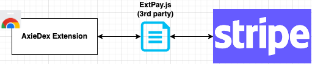

### PROS 🥰

- Very easy and quick to setup
- One time payment and monthly & yearly recurring subscriptions both available

### CONS 😅

- Not suitable for complex payment systems (subscriptions on top of a one-time payment for example)
- No full control over your customer payment & subscription data (impossible to manually make a particular customer as a subscribed member for example)

## 2. Custom solution with Stripe API

The other solution that I implemented after using Extension was a custom payment management system using the Stripe API directly. I would have consequently **full control over my subscription plans and my customer's data allowing me to customize without limit the way I bill my customer**.

For that, I used the following technologies:

- **Firebase Authentication** for customer authentication
- **Cloud Firestore** for Stripe customer and subscription data storage
- **Stripe Extension For Firebase** for payment processing

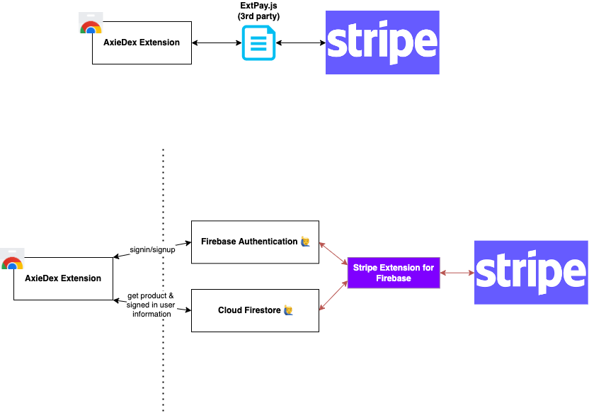

### What I want to achieve

I want:

- users to be able to **authenticate through the extension popup** (that is opened by clicking the extension icon)
- to **implement a one-time payment** of $25 that would unlock some unique features accessible through the popup
- to **implement a subscription plan** system for PRO users (who did the one-time payment) to implement another set of features through the popup
- users to be able to **manage their subscriptions**

#### Authentication

Beforehand, it is necessary to setup [Firebase Authentication](https://firebase.google.com/docs/auth) to enable sign-in and sign-up.

To authenticate a user through the popup, I make use of [FirebaseUI](https://firebase.google.com/docs/auth/web/firebaseui#:~:text=FirebaseUI%20is%20a%20library%20built,Twitter%20and%20GitHub%20sign%2Din.) library for handling my user sign-in/sign-up flows. Below you can see the sign-in/sign-up component of the extension.

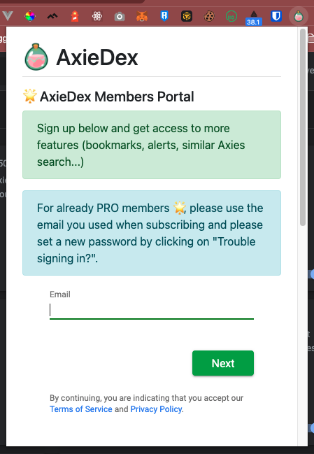

As a side note, it is also necessary to add your Chrome extension domain in the `Authorized domains` section in Firebase Authentication. This [documentation](https://cloud.google.com/identity-platform/docs/web/chrome-extension) might help you in setting up your authentication system.

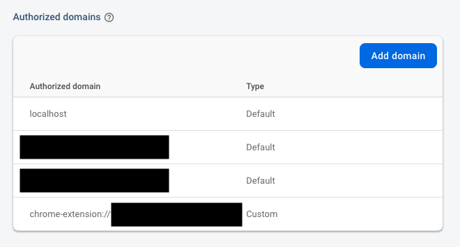

#### One time payment with Stripe

There is a Firebase [extension](https://firebase.google.com/products/extensions/stripe-firestore-stripe-payments?authuser=0&hl=en) that is **extremely useful as a backend for Stripe payments**. I made use of it for handling Stripe payments and for synchronizing my Cloud Firestore database and the Stripe data.

Before installing it, (as described in the documentation) I had to make sure the following Firebase services were setup:

- **Cloud Firestore** to store customer & Stripe subscription and product details
  - When a user sign-in into our app, a customer entry will be added into customers table
  - When a product (which is a subscription or a one-time payment) is created on Stripe, it will automatically be saved on Firestore too through a webhook
- **Firebase Authentication** for users sign-up and sign-in

After that, I installed it into my Firebase project and it will create automatically the following Cloud Functions.

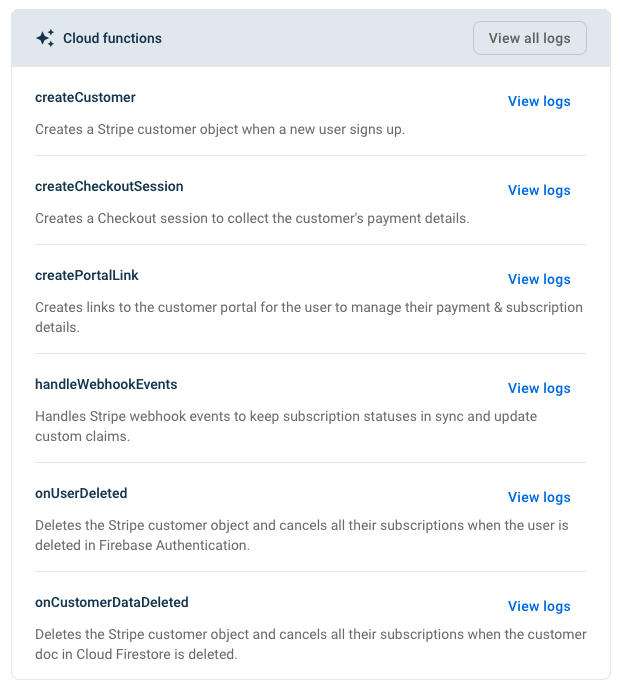

We can see that this extension already executes automatically actions on specific events so that we don't have to do it by ourselves. I try to explain in simple terms what they are actually doing.

- Create a Customer on Firestore when a user authenticates through Firebase Authentication (`createCustomer`)
- Create a Checkout Session and add the Stripe Checkout URL to the corresponding Firestore entry when a document has been created on `customers/{uid}/checkout_sessions/{id}` (`createCheckoutSession`)
- Create a Stripe Portal Link which is a link to access a customer portal for the user to manage payments & subscription when the following URL is accessed: https://us-central1-axiedex-xxxxx.cloudfunctions.net/ext-firestore-stripe-payments-createPortalLink (`createPortalLink`)
- Handle Webhook Events when Stripe events are sent to following URL: https://us-central1-axiedex-xxxxx.cloudfunctions.net/ext-firestore-stripe-payments-createPortalLink (`handleWebhookEvents`)
  - This webhook handler is doing things like synchronizing prices and products between Stripe and Firestore for example
- Delete a Stripe Customer when a user is deleted in Firebase Authentication (`onUserDeleted`)
- Delete a Stripe Customer when a Cloud Firestore customer document is deleted (`onCustomerDataDeleted`)

Once the extension installed, I thoroughly followed the documentation:

- for configuring Stripe webhooks that would trigger some actions on the Firebase side
- for creating product and pricing information
- for customizing the Stripe customer portal

Once everything setup, I was able to trigger a Checkout Session for collecting the customer's payment details and subsequently accepting one-time payments when they click on a `Upgrade now` button.

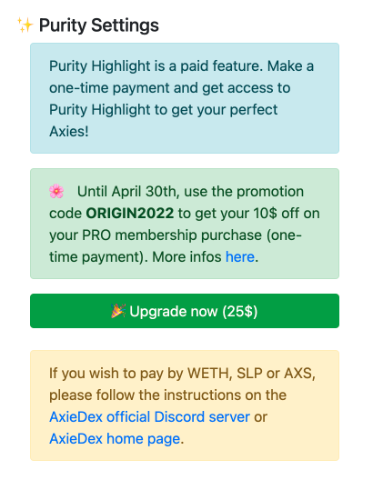

```javascript
// Triggered by the click on Upgrade Now

const docRef = await db
  .collection("customers")
  .doc(currentUser.uid) //
  .collection("checkout_sessions")
  .add({
    mode: "payment",
    price: "price_xxxxxxxxxxxxxxxxxxxx", // One-time price created in Stripe
    success_url: window.location.origin,
    cancel_url: window.location.origin,
  });

// Through the createCheckoutSession cloud function created by the Stripe extension, a Stripe Checkout URL will be
// saved to Firestore and will be accessed to open a Stripe checkout page.

// Wait for the CheckoutSession to get attached by the extension
docRef.onSnapshot((snap) => {
  const { error, url } = snap.data();
  if (error) {
    // Show an error to your customer and
    // inspect your Cloud Function logs in the Firebase console.
    alert(`An error occured: ${error.message}`);
  }
  if (url) {
    // We have a Stripe Checkout URL, let's redirect.
    chrome.windows.create({ url: url, type: "popup" }, function (w) {
      window.close();
    });
  }
});
```

The below window is then opened with the returned `url`.

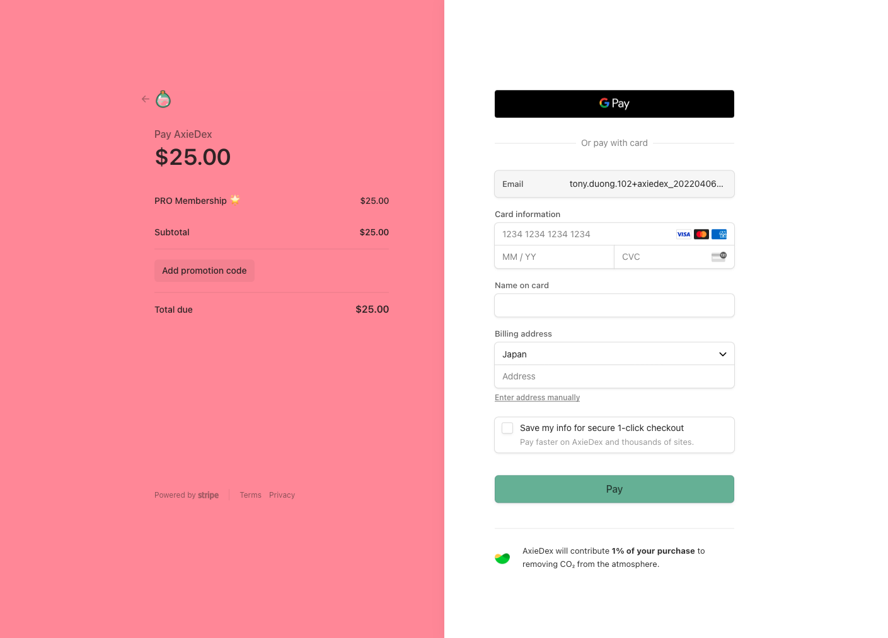

Finally, **once a payment has been completed, the customer becomes a 🌟 PRO member and unlocks some of the Chrome extension features**. To checkout whether or not a user has paid, I consult the Firestore database and **check the existence of a one-time payment with the help of the corresponding Stripe Price ID**.

```javascript
// firebase.js

async function getCustomerPaymentAndSubscriptions() {
  let data = {
    is_pro: null,
  };

  const paymentsSnapshot = await db
    .collection("customers")
    .doc(currentUser.uid)
    .collection("payments")
    .where("status", "in", ["succeeded"])
    .get();

  const payments = paymentsSnapshot.docs;
  for (const i in payments) {
    const payment = payments[i];
    for (const j in payment.data().items) {
      const item = payment.data().items[j];
      if (item.price.id == "price_xxxxxxxxxxxxxxxxxxxx") {
        data.is_pro = true; // Payment exists so the member is PRO
        break;
      }

      if (data.is_pro) break;
    }
  }

  return data;
}
```

```javascript
// contentScript.js

if (user.is_pro) {
  // show PRO features
}
```

#### Subscription for 🌟 PRO Members

Then, for those PRO members, **I wanted to allow them to subscribe monthly for another paid service** (yes, I was a bit greedy...).
For that, I displayed the following buttons only to those that did the one-time payment.

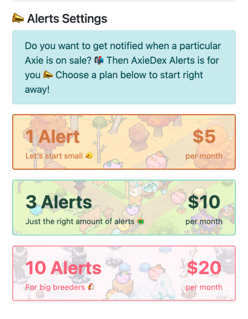

Each of these buttons **belongs to a Stripe Product** and are therefore **generated dynamically**, as you can see below.

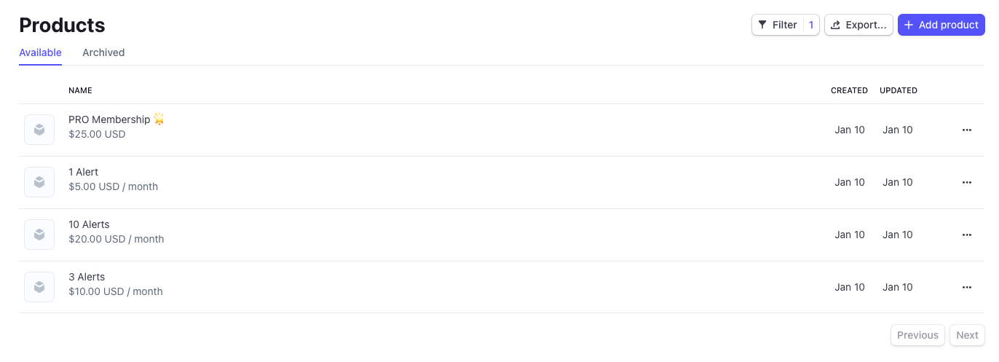

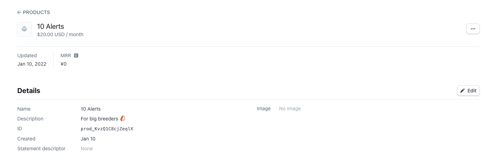

Now, when the customers selects a particular plan he wants to subscribe to, similarly to the one-time payment process, a Stripe Checkout Session will open and allow them to finalize the subscription.

```javascript
// price_id should be the selected subscription price ID

async function openStripeCheckout(price_id) {
  let stripeCheckoutSession = {
    price: price_id,
    success_url:
      "https://axiedex.notion.site/You-have-subscribed-to-AxieDex-Alerts/",
    cancel_url: "https://axiedex.notion.site/See-you-soon",
  };

  const docRef = await db
    .collection("customers")
    .doc(currentUser.uid)
    .collection("checkout_sessions")
    .add(stripeCheckoutSession);

  // Wait for the CheckoutSession to get attached by the extension
  docRef.onSnapshot((snap) => {
    const { error, url } = snap.data();
    if (error) {
      // Show an error to your customer and
      // inspect your Cloud Function logs in the Firebase console.
      alert(`An error occured: ${error.message}`);
    }
    if (url) {
      // We have a Stripe Checkout URL, let's redirect.
      chrome.windows.create({ url: url, type: "popup" }, function (w) {
        window.close();
      });
    }
  });
}
```

And the following window would open allowing customers to subscribe in one-click.

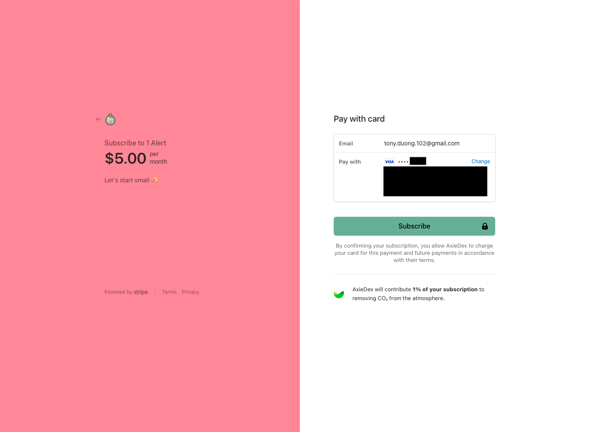

Once the subscription payment is successful, the customer gets access to even more features on the AxieDex extension 🎉

#### Subscription Management

Of course, it is also necessary to **allow customers to manage their subscriptions** (for cancellations or upgrade).
Triggering the below function was enough to open a Stripe Customer Portal to allow them to do so (notice that we are calling the Cloud Function that was generated by the Firebase Stripe extension).

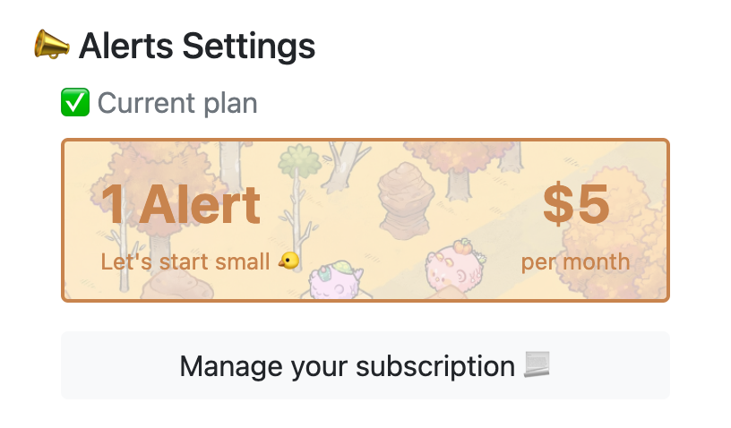

```javascript
// Trigerred when the `Manage your subscription` button is clicked
async function redirectToCustomerPortal() {
  const functionRef = firebase
    .app()
    .functions("us-central1")
    .httpsCallable("ext-firestore-stripe-payments-createPortalLink");
  const { data } = await functionRef({
    returnUrl: "https://axiedex.notion.site/See-you-soon",
  });
  chrome.windows.create({ url: data.url, type: "popup" }, function (window) {
    window.close();
  });
}
```

As a result, a Stripe Customer portal is opened in a popup window where **the customer can consult his current plan, billing information and previous invoices as well as updating to a new plan or cancelling the current one**.

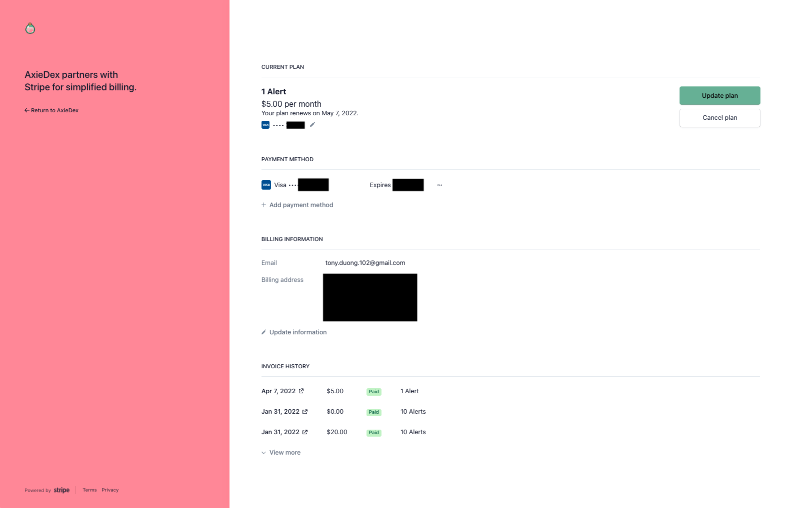

With that set, all the requirements have been successfully completed.

- ✅ users to be able to authenticate through the extension popup (that is opened by clicking the extension icon)
- ✅ to implement a one-time payment of $25 that would unlock some unique features accessible through the popup
- ✅ to implement a subscription plan system for PRO users (who did the one-time payment) to implement another set of features through the popup
- ✅ users to be able to manage their subscriptions

# It paid off...

At first, I was not really sure if I was going to make money out of it 🧐

In the end, I did earn some but most importantly, one thing was for sure: I learned a lot during this journey 🤯 and I will be confident the next time I will work on a Stripe payment processing project.

I also had a really fun experience creating a [Discord](https://discord.gg/bm7MEAX63F) 🎮 for my extension and interacting directly with my users to get their feedbacks and suggestions 📣 It was really fulfilling to see that people are actually using it and loving it 🥰

I wish you will also feel the same way when you build something and I hope this article helped you in monetizing your next Chrome extension project.
