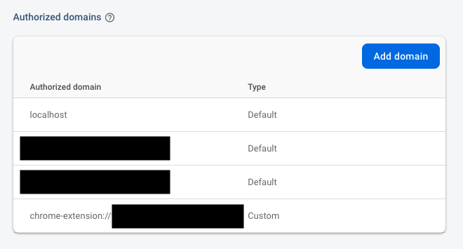
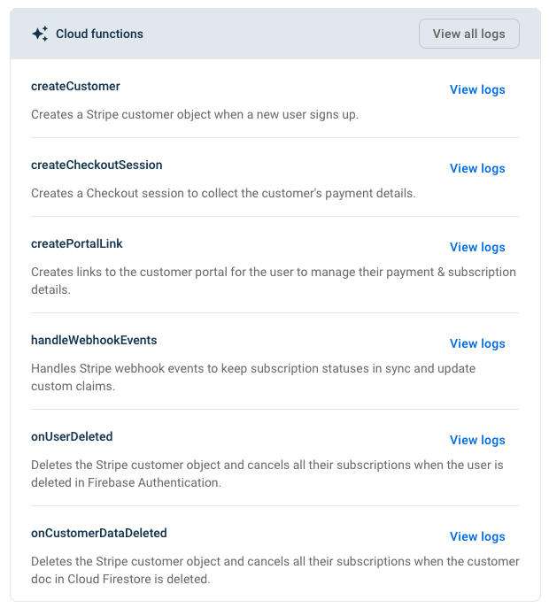

# What did I build?

Last year (September 2021), I built a useful Chrome Web Extension for improving the user experience on the [Axie Infinity Marketplace](https://marketplace.axieinfinity.com/axie/).

Axie Infinity is a NFT game that has revolutionized the world of gaming by allowing players to earn money while playing the game. On the Axie Infinity Marketplace, the players can buy characters called Axies which are played in the game.

The extension that I have developed adds some handy features such as:

- bookmarking Axies
- being alerted on Discord when a particular Axie has become on sale
- displaying useful information that are only accessible via API
- and so on...

# How did I make money out of it?

I wanted to make some features accessible only for subscribed members.
In order to manage subscriptions, I also wanted to use Stripe as a payment processor.

When I was looking for solutions for that, I found two solutions:

1. using a third-party library called ExtensionPay that would manage all the payments for me
2. building a custom solution integrating Stripe by myself

I opted for the first one at the beginning since I only wanted to have a simple one-time payment system and did not want to spend a lot of time developing one myself.

But then, 4 months later, I needed to complexify my payment system by adding a monthly subscription on top of the one-time payment which was not possible with ExtensionPay at the time.

That's why I removed the integration with ExtensionPay and started building my own solution using Stripe API.

## ExtensionPay

ExtensionPay is an extremely easy-to-use library.
You only need to create an account on their website, follow the "how to get started" steps, and finally add the library in your extension by following the [documentation](https://github.com/Glench/ExtPay).

As a result, you will have a completely functional payment system in less than 30 minutes.

### PROS 🥰

- Very easy and quick to setup
- One time payment and monthly & yearly recurring subscriptions both available

### CONS 😅

- Not suitable for complex payment systems (subscriptions on top of a one-time payment for example)
- No full control over your customer payment & subscription data (impossible to make a particular customer as a subscribe member manually for example)

## Custom solution with Stripe API

The other solution that I implemented after using Extension was a custom payment management system using the Stripe API directly. I would have consequently full control over my subscription plans and my customer's data allowing me to customize without limit the way I bill my customer.

For that, I used the following technologies:

- Firebase Authentication for customer authentication
- Firebase Firestore for customer management
- Stripe API for payment processing
- Google Cloud Functions for building an API that would return customers' information

### What I want to achieve

I want:

- users to be able to authenticate through the extension popup (that is opened by clicking the extension icon)
- to implement a one-time payment of $25 that would unlock some unique features accessible through the popup
- to implement a subscription plan system for PRO users (who did the one-time payment) to implement another set of features through the popup

#### Authentication

Beforehand, it is necessary to setup [Firebase Authentication](https://firebase.google.com/docs/auth) to enable sign-in and sign-up.

To authenticate a user through the popup, I make use of [FirebaseUI](https://firebase.google.com/docs/auth/web/firebaseui#:~:text=FirebaseUI%20is%20a%20library%20built,Twitter%20and%20GitHub%20sign%2Din.) library for handling my user sign-in/sign-up flows.

```javascript
// firebase.js

// Below configuration is provided in your Firebase Project settings
const firebaseConfig = {
  apiKey: "xxxxxxxxxxxxxxxxxxxxxxxx",
  authDomain: "chrome-extension://xxxxxxxxxxxxxxxxxxxxxxxx",
  projectId: "xxxxxxxxxxxxxxxxxxxxxxxx",
  storageBucket: "xxxxxxxxxxxxxxxxxxxxxxxx",
  messagingSenderId: "xxxxxxxxxxxxxxxxxxxxxxxx",
  appId: "xxxxxxxxxxxxxxxxxxxxxxxx",
  measurementId: "${config.measurementId}",
};

firebase.initializeApp(firebaseConfig);

// Initialize the FirebaseUI Widget using Firebase.
const ui = new firebaseui.auth.AuthUI(firebase.auth());

var uiConfig = {
  callbacks: {
    signInSuccess: function (user, credential, redirectUrl) {
      currentUser = user;
      return false;
    },
    uiShown: function () {
      // The widget is rendered.
      // Hide the loader.
      // document.getElementById('loader').style.display = 'none';
    },
  },
  // Will use popup for IDP Providers sign-in flow instead of the default, redirect.
  signInFlow: "popup",
  signInOptions: [firebase.auth.EmailAuthProvider.PROVIDER_ID],
  // Terms of service url.
  tosUrl: "https://www.firebase.com/",
  // Privacy policy url.
  privacyPolicyUrl: "https://www.firebase.com/",
};
```

```javascript
// popup.js

$(document).ready(function () {
firebase.auth().onAuthStateChanged(async function(user) {
  if (user) {
    // user is already signed in
    // ...
  } else {
    // show firebase UI for sign in
    ui.start('#firebaseui-auth-container', uiConfig);
  }
});
```

```html
// popup.html

<!DOCTYPE html>
<html>
  <head>
    <meta charset="utf-8" />
    <script src="popup.js"></script>

    <script src="https://www.gstatic.com/firebasejs/7.19.1/firebase-app.js"></script>
    <script src="https://www.gstatic.com/firebasejs/7.19.1/firebase-auth.js"></script>
    <script src="https://www.gstatic.com/firebasejs/7.19.1/firebase-firestore.js"></script>
    <script src="https://www.gstatic.com/firebasejs/7.19.1/firebase-functions.js"></script>
    <script src="https://www.gstatic.com/firebasejs/ui/6.0.0/firebase-ui-auth.js"></script>
    <link
      type="text/css"
      rel="stylesheet"
      href="https://www.gstatic.com/firebasejs/ui/6.0.0/firebase-ui-auth.css"
    />
    <script src="./firebase.js"></script>

    <link rel="stylesheet" href="lib/firebaseui.css" />
  </head>
  <body>
    <div>
      <header class="d-flex align-items-center mb-2">
        
        <h2 class="m-0">AxieDex</h2>
      </header>
      <hr class="mt-0" />
      <div id="members-portal" style="display:none;">
        <h5 class>🌟 AxieDex Members Portal</h5>
        <div class="alert alert-success" role="alert">
          Sign up below and get access to more features (bookmarks, alerts,
          similar Axies search...)
        </div>
        <div class="alert alert-info" role="alert">
          For already PRO members 🌟, please use the email you used when
          subscribing and please set a new password by clicking on "Trouble
          signing in?".
        </div>
        <div class="firebase-container container my-2 mb-4">
          <!--
          Firebase UI will be loaded inside this <div> 👇
          -->
          <div id="firebaseui-auth-container"></div>
        </div>
      </div>
    </div>
  </body>
</html>
```

It is also necessary to add your Chrome extension domain in the `Authorized domains` section in Firebase Authentication



#### One time payment with Stripe

There is a Firebase extension that is extremely useful as a backend for Stripe payments.

https://firebase.google.com/products/extensions/stripe-firestore-stripe-payments?authuser=0&hl=en

Before installing it, I had to make sure the following Firebase services were setup:

- Cloud Firestore to store customer & Stripe subscription and product details
  - When a user sign-in into our app, a customer entry will be added into customers table
  - When a product (which is a subscription or a one-time payment) is created on Stripe, it will automatically be saved on Firestore too through a webhook
- Firebase Authentication for users sign-up and sign-in

After that, I installed it into my Firebase project and it will create automatically the following Cloud Functions.



We can see that this extension already executes automatically actions on specific events, so that we don't have to do it by ourselves.
Once the extension installed, I thoroughly followed the documentation:

- for configuring Stripe webhooks that would trigger some actions on the Firebase side
- for creating product and pricing information
- for customizing the Stripe customer portal

Once everything setup, I was able to trigger a Checkout Session for collecting the customer's payment details and subsequently accepting one-time payments.

```javascript
const docRef = await db
  .collection("customers")
  .doc(currentUser.uid) //
  .collection("checkout_sessions")
  .add({
    mode: "payment",
    price: "price_xxxxxxxxxxxxxxxxxxxx", // One-time price created in Stripe
    success_url: window.location.origin,
    cancel_url: window.location.origin,
  });
```


Finally, once a payment has been completed, the customer becomes a PRO member and unlocks some of the Chrome extension features. To checkout whether or not a user has paid, I consult the Firestore database and check the existence of a one-time payment with the help of the Stripe Price ID.

```javascript
// firebase.js

async function getCustomerPaymentAndSubscriptions() {
  let data = {
    is_pro: null,
  };

  const paymentsSnapshot = await db
    .collection("customers")
    .doc(currentUser.uid)
    .collection("payments")
    .where("status", "in", ["succeeded"])
    .get();

  const payments = paymentsSnapshot.docs;
  for (const i in payments) {
    const payment = payments[i];
    for (const j in payment.data().items) {
      const item = payment.data().items[j];
      if (item.price.id == "price_xxxxxxxxxxxxxxxxxxxx") {
        data.is_pro = true; // Payment exists so the member is PRO
        break;
      }

      if (data.is_pro) break;
    }
  }

  return data;
}
```

```javascript
// contentScript.js

if (user.is_pro) {
  // show PRO features
}
```

### UI

F

# It paid off...

At first, I was not really sure if I was going to make money out of it.
In the end, I did earn some but most importantly, I had a really fun experience on my journey creating a Discord for my extension and interacting directly with my users to get their feedbacks and suggestions...
It was really fulfilling to see that people are actually using it and loving it.

I wish you will also feel the same way when you build something and I hope this article helped you in monetizing your next Chrome project.
