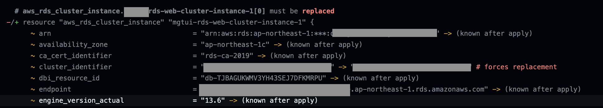
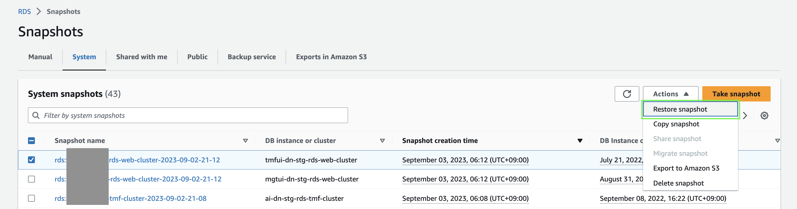
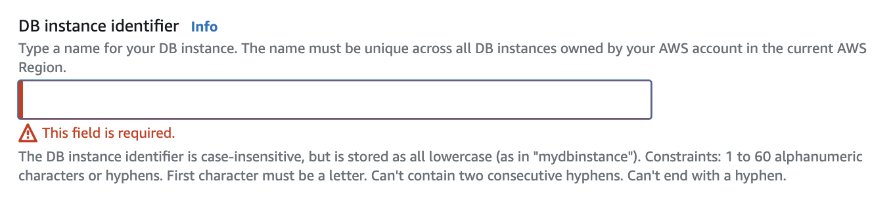

The other day, one of my client asked me to restore the data of a RDS instance that was lost due a `terraform apply` that replaced an existing RDS instance with the data in it. Fortunately, this happened in the `staging` environment and not in the `production` environment 💦 But still, it was a big blunder...

# The problem

The problem was that the client changed the database cluster identifier in the Terraform code for the RDS Aurora instance and executed an `terraform apply` without checking the output of the `terraform plan` beforehand. This caused Terraform to destroy the existing RDS instance and create a new one with the new cluster identifier. Consequently, the data in the old RDS instance was lost.


Below is the output of the `terraform apply` command that was executed inside GitHub Actions:



# Restoring the RDS instance

Fortunately, RDS Aurora instances are backed up automatically by AWS. So, I had to restore the RDS instance from the latest snapshot.
This can be done very easily from the AWS Console.

- Delete the existing RDS instance (that has no data in it) from the AWS Console. This is necessary because we need to use the same instance identifier for the restored RDS instance.

- Go to the RDS Dashboard and go to the `Snapshots` tab.

- Select the latest snapshot and click on `Restore snapshot`. In my case, I selected one of the automated snapshots that was taken before the `terraform apply` command was executed.



- Enter the new instance identifier (it has to match the one in Terraform), make sure that all the other information are correct and match those in Terraform (such as instance size, VPC settings, security groups etc.). Finally, click on `Restore DB cluster`.



- Wait for the RDS instance to be restored. This can take a while depending on the size of the database.

# Importing the RDS instance to Terraform

Now that the RDS instance is restored, we need to import it to Terraform so that it can manage it.
We are going to make use of the `terraform import` command for this.

```
terraform import aws_rds_cluster_instance.<resource_name> <instance_identifier>
terraform import aws_rds_cluster.<resource_name> <instance_identifier>-cluster
```

Then, I confirmed through `terraform plan` that Terraform is not going to either destroy or create the RDS instance. It should show no changes regarding the RDS instance.
```
terraform plan
```

# Conclusion

This was a very good lesson for me and the client. We should always check the output of the `terraform plan` command before executing `terraform apply` to avoid such fatal mistakes.
This is especially important when we are working with production environments.
