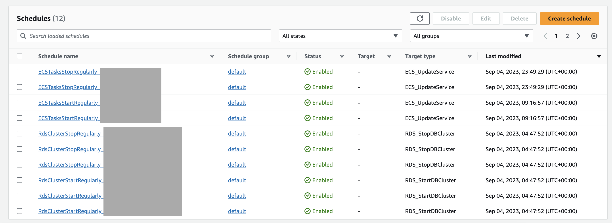
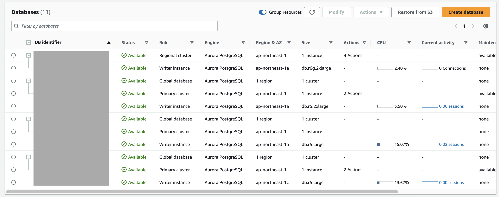
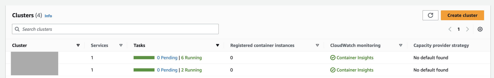
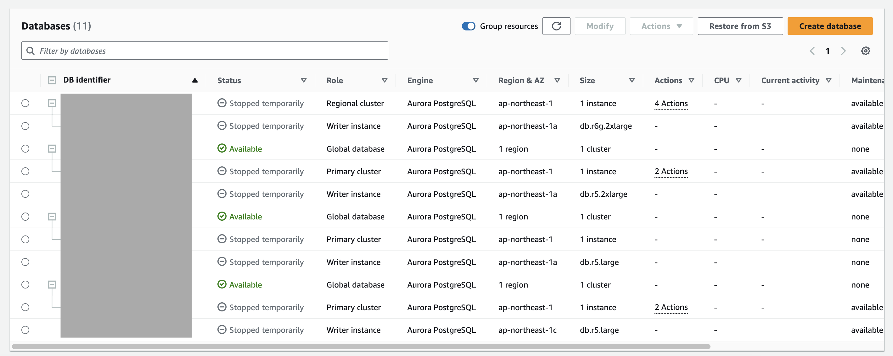
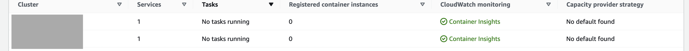

RDS and ECS can be quite expensive if they are running 24/7. So, it is a good idea to schedule their start and stop time to save some money 💰 especially if they are used for development and staging environments.

In this post, I am going to show you how to schedule the start and stop time of RDS and ECS with EventBridge using Terraform.

# Prerequisites
- Terraform CLI
- Access Key and Secret Key of an IAM user with the necessary permissions to create the resources (EventBridge Scheduler, IAM Policy, IAM Role...)

# Using locals to store the RDS and ECS resources
First, we need to store the ARN of the RDS and ECS resources in locals so that we can use them later in the EventBridge Scheduler.

```hcl

## eventbridge-scheduler.tf

locals {
  aws_rds_clusters = [
    aws_rds_cluster.rds-1-cluster,
    aws_rds_cluster.rds-2-cluster,
    aws_rds_cluster.rds-3-cluster,
  ]

  aws_ecs_services = [
    aws_ecs_service.ecs-1-service,
    aws_ecs_service.ecs-2-service,
  ]
}

# EventBridge Role and Policy
First, we need to create an IAM Role and Policy that will be used by EventBridge to start and stop the RDS and ECS instances.

```hcl
## eventbridge-scheduler.tf

# Create the IAM role that allows EventBridge to stop & start the RDS instances
# Allow EventBridge to assume this role with a trust policy
resource "aws_iam_role" "eventbridge-scheduler-role" {
  name = "EventBridgeSchedulerIAMRole"

  # Terraform's "jsonencode" function converts a
  # Terraform expression result to valid JSON syntax.
  assume_role_policy = jsonencode({
    Version = "2012-10-17"
    Statement = [
      {
        Action = "sts:AssumeRole"
        Effect = "Allow"
        Principal = {
          Service = "scheduler.amazonaws.com"
        }
      },
    ]
  })
}

# Define the policy document that allows EventBridge to stop & start the RDS instances and ECS tasks
data "aws_iam_policy_document" "eventbridge-scheduler-policy-document" {
  statement {
    effect = "Allow"
    actions = [
      "rds:StartDBCluster",
      "rds:StopDBCluster",
    ]
    resources = local.aws_rds_clusters[*].arn
  }

  statement {
    effect = "Allow"
    actions = [
      "ecs:UpdateService",
    ]
    resources = local.aws_ecs_services[*].id
  }
}

# Create the IAM policy using the policy document defined above
resource "aws_iam_policy" "eventbridge-scheduler-policy" {
  name        = "EventBridgeSchedulerPolicy"
  description = "Allows EventBridge to stop & start the RDS instances and ECS tasks"
  policy      = data.aws_iam_policy_document.eventbridge-scheduler-policy-document.json
}


# Attach the IAM Policy to the IAM Role
resource "aws_iam_role_policy_attachment" "eventbridge-scheduler-role-policy-attachment" {
  role       = aws_iam_role.eventbridge-scheduler-role.name
  policy_arn = aws_iam_policy.eventbridge-scheduler-policy.arn
}
```

Now that we have the IAM Role and Policy, we can create the EventBridge Scheduler.

# EventBridge Scheduler for RDS
In my case, I need to schedule the start and stop time of multiple RDS instances. So, I am going to create two EventBridge Scheduler for each RDS instance: one for starting the RDS in the morning at 7:30 and another one for stopping the RDS in the evening at 18:00.
Note that we use the `for_each` to loop through the RDS instances defined in locals.

For universal targets, we need to specify the ARN of the target and the ARN of the IAM Role that we created earlier. Please check the reference below for more information about the supported universal targets.

Reference: https://docs.aws.amazon.com/scheduler/latest/UserGuide/managing-targets-universal.html#supported-universal-targets

For RDS, the ARN of the target is `arn:aws:scheduler:::aws-sdk:rds:stopDBCluster` for stopping the RDS instance and `arn:aws:scheduler:::aws-sdk:rds:startDBCluster` for starting the RDS instance.
The input parameters defined in the `input` block are specific to the target. In our case, we need to specify the `DbClusterIdentifier` of the RDS instance that we want to start or stop. The parameters should be written in PascalCase.

```hcl

# EventBridge Scheduler for stopping the RDS in the evening at 18:00
resource "aws_scheduler_schedule" "stop-rds-regularly" {
  for_each = toset(local.aws_rds_clusters)

  name                         = "RdsClusterStopRegularly_${each.value}"
  group_name                   = "default"
  description                  = "Start ECS at 18:00. Operation time: 7:30 ~ 18:00"
  schedule_expression_timezone = "Asia/Tokyo"
  state                        = var.eventbridge_regular_stop_start_enabled ? "ENABLED" : "DISABLED"
  schedule_expression          = "cron(0 18 ? * MON-FRI *)"

  flexible_time_window {
    mode = "OFF"
  }

  target {
    arn      = "arn:aws:scheduler:::aws-sdk:rds:stopDBCluster"
    role_arn = aws_iam_role.eventbridge-scheduler-role.arn
    input = jsonencode({
      "DbClusterIdentifier" = each.value
    })

    retry_policy {
      maximum_retry_attempts       = 3
      maximum_event_age_in_seconds = 3600
    }
  }
}

# EventBridge Scheduler for starting the RDS in the morning at 7:30
resource "aws_scheduler_schedule" "start-rds-regularly" {
  for_each = toset(local.aws_rds_clusters)

  name                         = "RdsClusterStartRegularly_${each.value}"
  group_name                   = "default"
  description                  = "Start RDS at 7:30. Operation time: 7:30 ~ 18:00"
  schedule_expression_timezone = "Asia/Tokyo"
  state                        = var.eventbridge_regular_stop_start_enabled ? "ENABLED" : "DISABLED"
  schedule_expression          = "cron(30 7 ? * MON-FRI *)"

  flexible_time_window {
    mode = "OFF"
  }

  target {
    arn      = "arn:aws:scheduler:::aws-sdk:rds:startDBCluster"
    role_arn = aws_iam_role.eventbridge-scheduler-role.arn
    input = jsonencode({
      "DbClusterIdentifier" = each.value
    })

    retry_policy {
      maximum_retry_attempts       = 3
      maximum_event_age_in_seconds = 3600
    }
  }
}
```

# EventBridge Scheduler for ECS

Similarly, we can create two EventBridge Scheduler for each ECS service: one for starting the ECS service in the morning at 7:30 and another one for stopping the ECS service in the evening at 18:00. We only need to update the `desired_count` of the ECS service to 0 to stop it and to the original value to start it.

The ARN of the target for ECS is `arn:aws:scheduler:::aws-sdk:ecs:updateService` and the input parameters are `Service`, `Cluster` and `DesiredCount`.

```hcl
resource "aws_scheduler_schedule" "stop-ecs-regularly" {
  for_each = tomap({
    for e in local.aws_ecs_services :
    e.name => {
      name          = e.name
      cluster       = e.cluster
      desired_count = e.desired_count
    }
  })

  name                         = "ECSTasksStopRegularly_${each.value.name}"
  group_name                   = "default"
  description                  = "Stop ECS at 18:00. Operation time: 7:30 ~ 18:00"
  schedule_expression_timezone = "Asia/Tokyo"
  state                        = var.eventbridge_regular_stop_start_enabled ? "ENABLED" : "DISABLED"
  schedule_expression          = "cron(0 18 ? * MON-FRI *)"

  flexible_time_window {
    mode = "OFF"
  }

  target {
    arn      = "arn:aws:scheduler:::aws-sdk:ecs:updateService"
    role_arn = aws_iam_role.eventbridge-scheduler-role.arn
    input = jsonencode({
      "Service"      = each.value.name,
      "Cluster"      = each.value.cluster,
      "DesiredCount" = 0
    })

    retry_policy {
      maximum_retry_attempts       = 3
      maximum_event_age_in_seconds = 3600
    }
  }
}

resource "aws_scheduler_schedule" "start-ecs-regularly" {
  for_each = tomap({
    for e in local.aws_ecs_services :
    e.name => {
      name          = e.name
      cluster       = e.cluster
      desired_count = e.desired_count
    }
  })

  name                         = "ECSTasksStartRegularly_${each.value.name}"
  group_name                   = "default"
  description                  = "Start ECS at 7:30. Operation time: 7:30 ~ 18:00"
  schedule_expression_timezone = "Asia/Tokyo"
  state                        = var.eventbridge_regular_stop_start_enabled ? "ENABLED" : "DISABLED"
  schedule_expression          = "cron(30 7 ? * MON-FRI *)"

  flexible_time_window {
    mode = "OFF"
  }

  target {
    arn      = "arn:aws:scheduler:::aws-sdk:ecs:updateService"
    role_arn = aws_iam_role.eventbridge-scheduler-role.arn
    input = jsonencode({
      "Service"      = each.value.name,
      "Cluster"      = each.value.cluster,
      "DesiredCount" = each.value.desired_count
    })

    retry_policy {
      maximum_retry_attempts       = 3
      maximum_event_age_in_seconds = 3600
    }
  }
}
```

# Results in the AWS Console

After a `terraform apply`, we can see the EventBridge Scheduler in the AWS Console.



## Between 7:30 and 18:00 (Operation time)

Between 7:30 and 18:00, the RDS and ECS instances are running.





## Between 18:00 and 7:30 (Off time)

Between 18:00 and 7:30, the RDS and ECS instances are stopped.





# Conclusion

In this post, I showed you how to schedule the start and stop time of RDS and ECS with EventBridge using Terraform.
The concept should be the same with other AWS resources.
This is a great way to save some money 💰 especially if the resources are not used 24/7.
