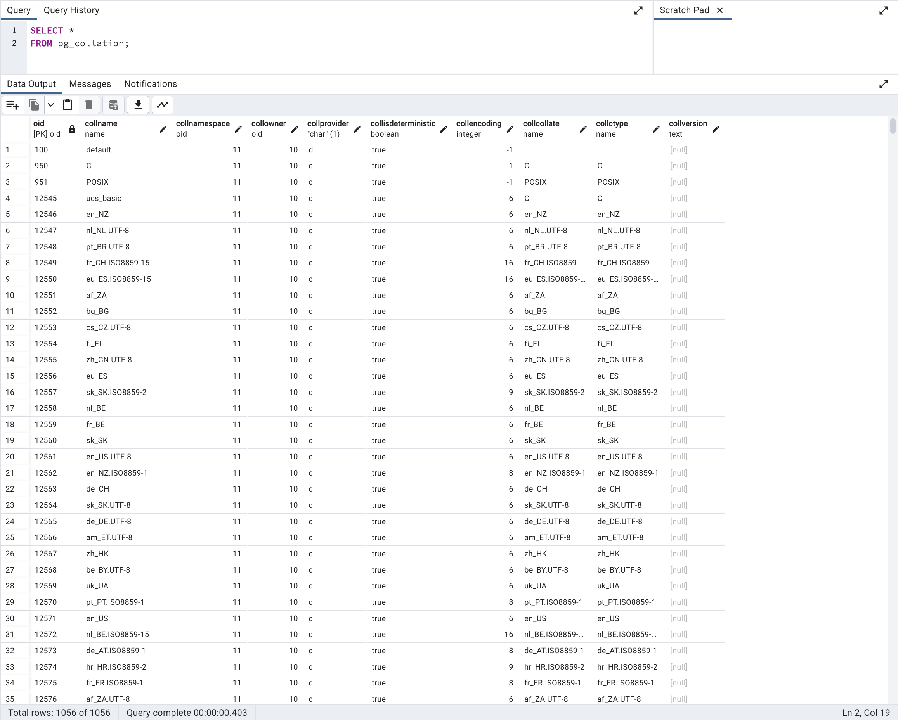
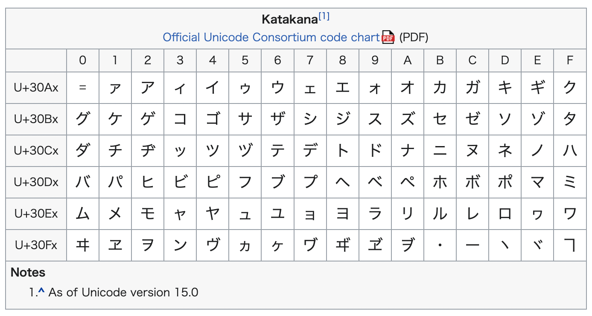

I learned something new while trying to solve the following problem in one of my project.
- Data and code is identical on both the development and the staging environment.
- When sorting the records retrieved from the database by name (a string field containing mostly Japanese name in katakana), the displayed order was different.

Well, there isn't a single difference in the code and data so why is the order different?
After doing some research, one of my mentor told me about the existence of the `collation` settings on databases. What is that?

## What is COLLATION in databases?

According to [`database.guide`](https://database.guide/what-is-collation-in-databases/),
> Collation specifies how data is sorted and compared in a database. Collation provides the sorting rules, case and accent sensitivity properties for the data in the database.
> For example, when you run a query using the ORDER BY clause, collation determines whether or not uppercase letters and lowercase letters are treated the same.

So this might possibly be the cause of the problem... The `collation` settings value may be different on both the environments.

Collation can set at different levels:
- database level
- table level
- column level
- query level

The collation at lower level (if specified) overrides those set at a higher level.


## Collation on PostgreSQL and Rails

The collation must be set with one of the available value. The list of available values differs depending on the database management system you are using.
We are going to focus on the PostgreSQL case here.

It is possible to list all the available collations for PostgreSQL by running the following query.
It returns a list of 1056 collations.

```sql
SELECT *
FROM pg_collation;
```




Now, let's determine what is the collation used on both my development and staging databases. Using the following query, we can retrieve the current collation

**Database Level**

```sql
SELECT datname, datcollate
FROM pg_database
WHERE datname = 'xxx_development';

# Returning 'xxx_development' | 'C'
```

```sql
SELECT datname, datcollate
FROM pg_database
WHERE datname = 'xxx_staging';

# Returning 'xxx_staging' | 'en_US.UTF-8'
```

**Column level**
```sql
SELECT table_schema, table_name, column_name, collation_name
FROM information_schema.columns
WHERE table_name = 'users' AND column_name = 'full_name'
ORDER BY table_schema, table_name;

# Returning 'public' | 'users' | 'full_name' | null
```

Now, we have determined that the collation is different on both databases and that it is not set at the column level.

## Fixing the collation

Well, we had several options about the fix of the database.
- Changing the collation of the database (very risky) as it is very hard to determine the extent of impact. This might result in unexpected bugs.
- Changing the collation at the column level. This is a simple solution where the impact range can be narrowed down to that one `full_name` column.
- Specifying the collation at the query level. This is the safest option but introduces some overhead as we need to think about it every time we use a similar query for the same column anywhere else in the project.

We finally opted for the second solution. Since we were working on Rails, we created a migration for changing the collation for that one column.

```ruby
class ChangeFullNameCollationToC < ActiveRecord::Migration[7.0]
  def change
    change_column :users, :full_name, :string, collation: "C"
  end
end
```

`C` seems to be working for us since according to `https://www.postgresql.org/docs/current/collation.html`,

> The C and POSIX collations both specify “traditional C” behavior, in which only the ASCII letters “A” through “Z” are treated as letters, and sorting is done strictly by character code byte values.

And looking at this [chart](https://en.wikipedia.org/wiki/Katakana_(Unicode_block)), Katakana characters are in the right order (the one we expected) when sorted by character code byte values (unicode to code byte).



This fixed our simple but serious problem about the sort functionality in our application 🎉
