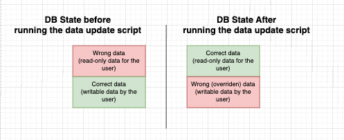
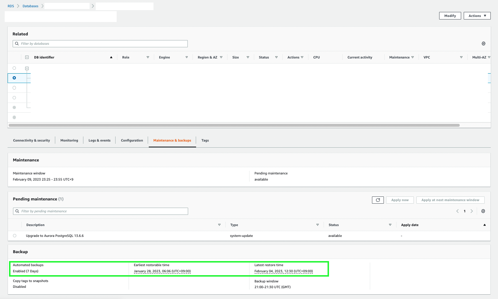

In my recent project, one of the worst incident that could happen happened: data were overwritten by mistake when performing data update directly on the database.

I am not going to lie. It was my most stressful experience in this project.
Because of a lot incorrect data present in the database at that time, our client asked us to correct them as quickly as possible (by the same day) and one of the solution that I proposed was to create a Ruby script for patching the data and running it from the Rails console from inside one of the ECS containers.

I wrote it in a haste, tested it in local and staging environment and everything went fine. Data were corrected successfully.
But there was one side-effect that I haven't considered. This script would also override some other data that are input by the end-user as a side effect.

I didn't notice it until our client told us about it. Big blunder. I needed to fix it as soon as possible and restore the data.

# RDS and Point-in-time recovery

So this was our database state before and after the script.

I had to find a solution, propose it and quickly implement it.

What are we using as database? AWS RDS Aurora.
Is there a way to restore the data? Yes.
To a point in time before I ran the script? YES!

You can actually see how the database is set to create backups in AWS console.

In our case, the database was restorable in any point in time with a resolution of one minute within the last 7 days.
Restoring a DB instance to a specific point in time will create new DB instance.

We chose not to point our application to the new database but instead we went with the following steps:
- Connecting to the new restored database through pgAdmin and SELECT the data that needs to be recovered
- Checking the validity of the data and export an CSV file containing the data and some fields that would allow us to find them in the production database. The primary key ID was also overriden because the update was a destroy->create operation instead of a simple update so we need to match the data using other non-modifiable fields such as time, foreign key IDs...
- Writing a Ruby script that would take the CSV file as an input and update the production database with correct data, making no other data would be modified.
- Run it.
- Checking that the data is now correct.
- Close the restored database.

# I won't update producton databases carelessly anymore...

In such an emergency situation, I was so focused on doing it quickly rather than spending time checking. I ended up spending more time in total than I would have if I took the time to check it with my colleagues.

If I had to redo it, I would create a copy of the production database and running the scripts against it.
Thus, it would have been so much safer and easier to check as well since you can directly check the difference between the two. I would have spot the differences of data right away and fix what was wrong in my script.

This kind of experience is so stressful but I believe I grew up wiser from this.
