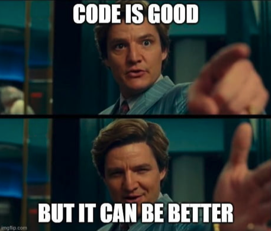

**Hello! 👋**
I am Tony. I joined [Overflow](https://overflow.co.jp/) about two years and a half ago. Since then, I can say I have grown tremendously as a software engineer. I was still an inexperienced web full-stack developer when I took the challenge at overflow and so I still had a lot to learn. The following might be trivial for experienced developers but for those just starting in the software development world, I really hope **it can provide you valuable insight for your career**.

# Working as a team instead of as a lone-wolf engineer 🙌

Before working at overflow, I was used to developing things on my own. In my previous company, after freshly graduating from university, I joined a small e-commerce company as a full-stack web developer. Even though there was another web developer in the company, we didn’t work hand in hand. Instead, we were moving along with our respective projects on our own.

During this solitary adventure, the pace of learning and developing was fast and I can’t say I didn’t learn a lot. Nevertheless, I realized (_after leaving the company_) that contributing to each other’s work and work in a more cooperative way would have been beneficial in the long-term.

## Code Reviews 👀

**After joining overflow, all my code was reviewed before any deployment**.

At first, after developing a feature and making sure it worked by doing manual tests, I just passed the PR for verification. Guess what? The reviewers pointed out silly mistakes such as a logging statement that was still there, typos, etc.

So now, I always keep in mind that **I code for someone else by asking myself “Would this be understandable by someone else?”.** And that prevented me from silly variable names, complex algorithms and helped me with writing clean, modular code that would be understandable by itself.

## You are the first reviewer of your own code! 🔍

This is a rule I learned to abide by. This will avoid embarrassing mistakes and code to be seen by your colleagues and consequently avoid waste of time. Of course, no developer is perfect and you will still leave some parts that might need improvements. Be open to suggestions and critics and learn as much as you can from them.

## I found mentors 👨‍🏫

> “Mentoring is a brain to pick, an ear to listen, and a push in the right direction.” by John C. Crosby

Finding mentors and role-models has been life-changing in my developer journey. All the development team members have contributed so much to my skill growth but also my personal growth. **Alone, I would not have reached the level I am in today.** I can say I have been blessed to work with such an amazing team.

## Ask questions (after asking Google first) 📣

I sometimes found myself with embarrassing questions. The kind of questions that would make a fool of myself. **Ask them.** But make sure it is not something you would have understood by yourself with a little bit of research on Google or Stackoverflow.

An ancient Chinese proverb says, “He who asks a question remains a fool for 5 minutes. He who does not ask, remains a fool forever.”.

## Learning to talk to non-technical people 🐱

In overflow, there were times where I needed to discuss with non-technical people (marketing team, customer success team, project managers …) about some tasks that needed to be done.

It might be obvious but **you don’t communicate the same way with them and your fellow development team members.** Adapting my language in order to be understood was key in this kind of interaction:

- Avoiding technical jargon when possible
- Use diagrams whenever possible as “A picture paints a thousand words.”
- Add details when necessary so there is no ambiguity in your statements

I have never been an amazing talker but this is definitely a skill I’d improve in my career.

# Let’s get to work... 👨🏻‍💻

Well, as everyone knows, being a developer involves a lot of time alone. You will face problems that only you will need to resolve.

## Organizing my ideas 📝

When taking on a new task, **I have learned the importance of “preparing the field before doing the actual work”.** I had the habit of jumping right into the implementation while having the plan “inside my head”. This led sometimes to crappy design, missing requirements, unexpected scenarios… you name it! But after doing all the preliminary design, my thoughts became clear and I knew exactly what needed to be done, in what order and how it should be implemented. This also serves as a documentation you can share with your colleagues.

## Getting out of my comfort zone 😱

Sometimes, it is possible for me to choose the tasks you want to take on for the next two-week sprint. These tasks range from bugs, feature implementation to infrastructure related tasks. Having the worry of not being able to complete a daunting task is quite stressful (at least for me!). Even so, I tried to challenge myself regularly with these. One thing is for sure: **the feeling of satisfaction is amazing when you manage to achieve such tasks.** You get out with **newly acquired knowledge**, with **more confidence** in your abilities and skills. Of course, you will be supported by your colleagues that would provide you with insightful advice.

I would recommend anyone who wants to level up to sometimes challenge tasks that are a bit out of your comfort zone.

## Have a high-level understanding of your project 🌏

It is quite easy to get absorbed into your coding and not care too much what is happening around. In my case, I joined overflow with no deep knowledge in infrastructure. That was like a black box for me.

With time, **I learned more about every aspect of the project I was working on** (architecture, deployment, caching, networking) and that helped me with understanding how all components are interconnected and thus, building better design, being better at debugging …

# Working in a Japanese-style environment 🇯🇵

I really wanted to improve my Japanese language skills and learn more about Japanese culture.
Working in a Japanese company where all communication is done in Japanese was already a big challenge by itself.

I could not understand more than 30% of the discussion we had in meetings the first months I joined overflow. Learning Japanese a bit on the side has been helping tremendously.

Even though I felt stressed at the beginning by not being understood and by not being able to communicate my thoughts as clearly as I wanted to, **I inevitably learned by doing**. To tell you the truth, after two years, I am not feeling 100% comfortable yet but still, I can feel the progress I have made so far.

For the foreigners that are still hesitant about joining a Japanese company because of communication issues, **I would recommend giving it a try.** It might not be comfortable but you will feel that sense of accomplishment and growth.

A lot of IT companies in Japan are becoming more and more open to foreigners and remote-work recently so the opportunities are not lacking.

---

This was my high-level experience as a web engineer for the last two years. I learned a lot of things in the last two years and I am also sure that I will for the coming years. I hope this will help you in any way for your career. If you are looking for a job in the IT field in Japan, feel free to register on [offers.jp](https://offers.jp) and browse the available job offers on [offers.jp/jobs](https://offers.jp/jobs).
